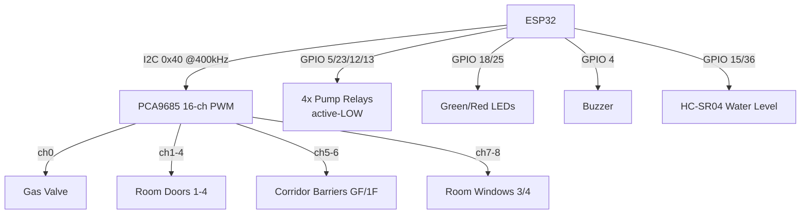
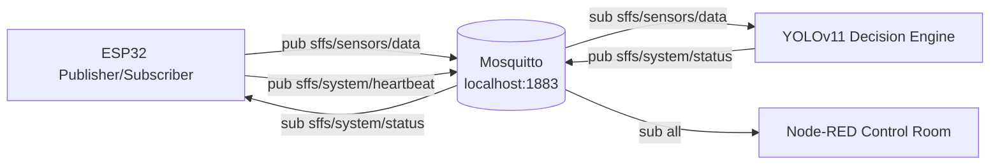
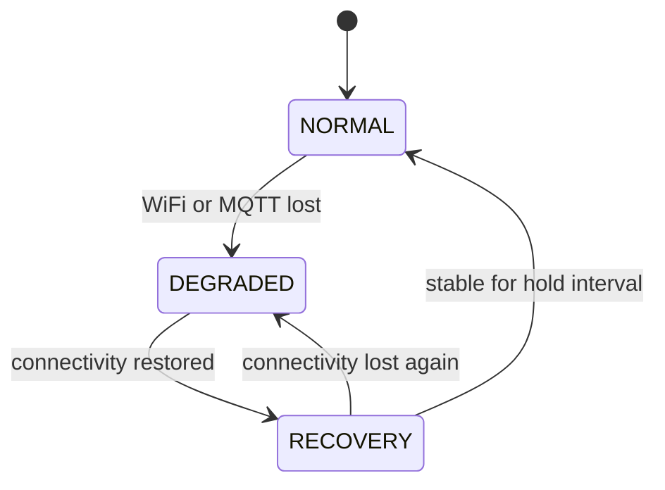

# Chapter 1: Introduction & Project Overview

## 1.1 Background and Motivation

### 1.1.1 The Historical Evolution of Automated Fire Suppression

Automated fire protection has progressed through four broadly identifiable technological generations, each defined by the sensing modality available to it and by the control philosophy that modality permitted. Understanding this trajectory is essential, because the Smart Fire Fighting System (SFFS) presented in this thesis is best understood not as an incremental improvement on any single generation, but as a deliberate convergence of the strengths of the most recent two.

The **first generation** — thermal-fusible suppression — emerged with the wet-pipe sprinkler. Its detection element is a glass bulb or fusible metal link that ruptures at a fixed temperature (typically 68 °C). This couples detection and actuation into a single passive mechanism: the same heat that signifies a fire also opens the valve. The approach is extraordinarily reliable precisely because it contains no electronics, but its decision rule is a degenerate one-bit threshold on a single physical variable, temperature, sampled at a single point. It cannot detect a fire before flashover-grade heat reaches the sensing element, it cannot distinguish a fire from a heat source, and it has no concept of *where* within a structure the event is occurring beyond the head that happens to rupture.

The **second generation** — electrical point detection — replaced the fusible element with ionization and photoelectric smoke detectors and fixed-temperature/rate-of-rise heat detectors wired to a central fire-alarm control panel (FACP). This decoupled detection from actuation and introduced the notion of a monitored *zone*. However, the decision logic remained a static comparison of a single transduced quantity against a fixed threshold. Such systems are notorious for false alarms: a photoelectric cell cannot chemically distinguish combustion aerosol from cooking vapour, shower steam, or dust, and consequently a large fraction of activations are nuisance events. The economic and behavioural cost of these false alarms — desensitization, disabled detectors, and delayed human response — is itself a documented safety hazard.

The **third generation** — addressable and analogue-addressable systems — added digital communication between detectors and the panel, allowing per-device identification and software-adjustable thresholds. This improved spatial resolution and enabled drift compensation, but the underlying epistemology did not change: a fire was still inferred from a one-dimensional signal crossing a programmed level, with no independent confirmation channel and no semantic understanding of the scene.

The **fourth generation**, of which the SFFS is an instance, introduces two qualitatively new capabilities: *multi-modal sensor fusion* and *machine perception*. Rather than trusting any single transducer, a fourth-generation system combines chemical sensing (multiple gas species), optical sensing (infrared flame signature), environmental sensing (temperature and humidity), and — decisively — computer vision, which supplies an independent, semantically rich confirmation of the event. Equally important is *where* the intelligence resides: fourth-generation systems push deterministic control to the network edge (an embedded microcontroller) while reserving heavy perceptual computation for a local accelerated processor, eliminating the cloud round-trip latency and connectivity dependence that compromise centralized architectures during precisely the emergencies they are meant to manage.

### 1.1.2 Legacy Static-Threshold Hardware versus Multi-Zone Requirements

A modern multi-occupancy structure is not a single thermodynamic volume; it is a set of compartments with independent fire loads, ventilation conditions, and occupancy states. A legacy static-threshold installation models this reality poorly. Its decision function for any detector $d$ is the indicator

$$
A_d(t) = \mathbb{1}\!\left[\, s_d(t) \ge \theta_d \,\right],
$$

where $s_d(t)$ is the single transduced signal and $\theta_d$ a fixed threshold. Three structural deficiencies follow directly from this formulation. First, because $\theta_d$ is fixed and $s_d$ is one-dimensional, the false-alarm probability $P(A_d \mid \neg\text{fire})$ cannot be reduced without simultaneously raising the miss probability $P(\neg A_d \mid \text{fire})$ — the detector sits on a single, unfavourable point of a receiver-operating-characteristic curve it can never leave. Second, the indicator carries no zonal semantics: the system response is building-wide regardless of which compartment is involved, forcing undifferentiated, structure-wide suppression and evacuation. Third, the model has no representation of occupancy, so suppression decisions are made blind to the location of trapped individuals.

A multi-zone requirement therefore demands a fundamentally richer decision function: one that evaluates each compartment $r \in \{1,2,3,4\}$ independently, that fuses several heterogeneous signals so the operating point can be moved off the single-sensor ROC curve, and that incorporates an occupancy estimate into the response. This is exactly the function the SFFS implements, and Section 1.2 develops the physical reasons each of these requirements is non-negotiable.

### 1.1.3 The Structural Shift to Edge AI and Localized Embedded Intelligence

The SFFS realizes fourth-generation capability through a two-tier division of labour. A deterministic embedded tier — an **ESP32** microcontroller — performs continuous multi-sensor acquisition and drives all physical suppression hardware under a hard real-time control loop. A probabilistic perception tier — a **YOLOv11** convolutional detector executing on a local GPU in **CUDA FP16** — supplies visual fire/smoke confirmation and occupancy tracking. The two tiers are connected only by a local **Mosquitto MQTT** broker, so that each can fail or be upgraded independently and, critically, so that the embedded tier retains full autonomous suppression authority even when the perception tier or the network is unavailable.

This partitioning is motivated by the complementary error profiles of the two tiers. The chemical and optical sensors on the ESP32 have low latency and high availability but limited specificity; the vision model has high specificity and contextual awareness but higher latency and a dependence on adequate illumination and field of view. Fusing them yields a system whose false-alarm rate is bounded by the *agreement* of independent modalities while its miss rate is bounded by their *disjunction* — a formal advantage analysed in Section 1.4.

```mermaid
graph LR
    subgraph Perception Tier (GPU PC)
        CAM[Camera Feed] --> YOLO[YOLOv11 nano<br/>CUDA FP16<br/>best_nano_111.pt]
        YOLO --> OCC[Line-Crossing<br/>Occupancy Tracker]
        YOLO --> DEC[Decision Engine<br/>Sensor + Vision Fusion]
        OCC --> DEC
    end
    subgraph Middleware
        BRK[(Mosquitto Broker<br/>localhost:1883<br/>MQTT v3.1.1)]
    end
    subgraph Control Tier (ESP32)
        SENS[MQ-2/5/6/7 · IR Flame<br/>DHT22 · HC-SR04 · Buttons] --> LOOP[Level-Driven<br/>Control Loop]
        LOOP --> ACT[PCA9685 → 9 Servos<br/>4 Pump Relays · LEDs · Buzzer]
    end
    DEC -- sffs/system/status --> BRK
    BRK -- command --> LOOP
    LOOP -- sffs/sensors/data --> BRK
    BRK -- telemetry --> DEC
    BRK --> DASH[Node-RED<br/>SFFS Control Room]
    DEC --> TG[Telegram Bot<br/>sffs_bot]
```

**Figure 1.1:** Two-tier hybrid edge architecture of the SFFS, showing the deterministic ESP32 control tier and the probabilistic GPU perception tier decoupled by a local MQTT broker.

A quantitative contrast between the four generations clarifies what the architectural shift buys. Table 1.1 compares representative response latencies (time from ignition-relevant stimulus to actuation decision), qualitative false-alarm susceptibility, and contextual awareness.

| Attribute | Gen-1 Fusible | Gen-2 Point Detect | Gen-3 Addressable | Gen-4 SFFS (this work) |
|---|---|---|---|---|
| Detection variables | 1 (heat) | 1 per device | 1 per device (tunable) | 6+ fused (4× gas, flame, vision, env) |
| Decision rule | Fixed melt point | Static threshold | Software threshold | Multi-modal fusion + edge AI |
| Local actuation latency | Seconds–minutes (thermal mass) | 100s ms–s (panel) | 100s ms (bus) | One control cycle (deterministic, edge) |
| Vision confirmation latency | — | — | — | Single CUDA FP16 inference |
| False-alarm susceptibility | Low (but late) | High (single-modality) | Medium | Low (cross-modal agreement) |
| Spatial / zonal resolution | Per-head | Per-zone (coarse) | Per-device | Per-room, independent (×4) |
| Occupancy awareness | None | None | None | Line-crossing vision counter |
| Network dependence for control | None | Wired panel | Wired bus | None (fail-operational edge) |

**Table 1.1:** Generational comparison of automated fire-suppression architectures across detection breadth, latency, false-alarm susceptibility, and contextual awareness.

The remainder of this chapter formalizes the engineering problem that motivates each design choice (Section 1.2), specifies the proposed architecture in depth (Section 1.3), states measurable design objectives (Section 1.4), and outlines the structure of the thesis (Section 1.5).

## 1.2 Engineering Problem Statement

The deficiencies catalogued above are not merely operational inconveniences; they are consequences of physical processes — combustion chemistry, compartment thermodynamics, suppression hydraulics, and human egress dynamics — that any credible fire-management system must respect. This section analyses those processes to justify, from first principles, the three central design commitments of the SFFS: multi-species chemical sensing, zonal four-pump isolation, and occupancy-aware suppression.

### 1.2.1 Volumetric Hazard Propagation in Enclosed Multi-Room Spaces

**Fire growth and heat release.** In the pre-flashover phase, the heat-release rate of an accelerating compartment fire is well approximated by the *t-squared* growth model

$$
\dot{Q}(t) = \alpha\, t^{2},
$$

where $\dot{Q}$ is the heat-release rate (kW), $t$ is time from ignition (s), and $\alpha$ is the fire-growth coefficient (kW·s⁻²). Standardized growth classes range from *slow* ($\alpha \approx 0.0029$) through *medium* ($0.012$), *fast* ($0.047$), to *ultra-fast* ($0.19$). The quadratic dependence is the quantitative core of the early-detection argument: because hazard accumulates as $t^2$, the safety benefit of reducing detection latency $\Delta t$ is super-linear. A system that confirms and actuates one growth-time-constant earlier does not merely save proportional damage; it intervenes while $\dot{Q}$ is still on the shallow part of the parabola.

**Smoke layer descent.** Hot combustion products form a buoyant plume that entrains air, rises, and accumulates as an upper layer whose interface descends over time. For a compartment of floor area $A_f$ and height $H$, a first-order estimate of the time for the smoke interface to descend to a clear height $z$ couples the plume mass-entrainment rate $\dot{m}_p$ to the volume below the interface:

$$
t_{\text{descent}} \;\approx\; \frac{A_f\,\rho_{\infty}}{\dot{m}_p}\,(H - z),
\qquad
\dot{m}_p \;\propto\; \dot{Q}_c^{\,1/3}\, z^{5/3},
$$

with $\dot{Q}_c$ the convective fraction of the heat-release rate. The practical consequence for a four-room structure is that each compartment has its *own* descent timeline governed by its *own* $A_f$, $H$, ventilation, and fire load. A single building-wide detector cannot represent four independent descent processes; per-room sensing is required to track them.

**Toxic-gas accumulation.** The lethal mechanism in most fire fatalities is not thermal but toxicological, dominated by carbon monoxide and, where hydrocarbon fuels are present, by oxygen depletion and irritant gases. The cumulative physiological insult is captured by the *Fractional Effective Dose* (FED) model, in which exposure increments integrate over time:

$$
\text{FED}(t) \;=\; \int_{0}^{t} \frac{C_{\text{CO}}(\tau)}{(\text{Ct})_{\text{incap}}}\; d\tau \;\ge\; 1 \;\Rightarrow\; \text{incapacitation},
$$

where $C_{\text{CO}}$ is the instantaneous CO concentration and $(\text{Ct})_{\text{incap}}$ the concentration-time product associated with incapacitation. Because FED is an *integral*, both the concentration and the duration matter; early detection and ventilation directly reduce the integrand and the integration interval. The SFFS instruments each room with a CO-sensitive **MQ-7** specifically because CO is the dominant toxicological agent, and complements it with **MQ-2/5/6** for the combustible-hydrocarbon and smoke channels.

**Flammable-gas explosion risk.** Where LPG is present (a common domestic fuel), the hazard is not only fire but deflagration. A gas–air mixture is explosive only between its lower and upper flammability limits; for LPG these are approximately

$$
\text{LEL}_{\text{LPG}} \approx 2.1\%\ \text{vol}, \qquad \text{UEL}_{\text{LPG}} \approx 9.5\%\ \text{vol}.
$$

An enclosed room that accumulates leaking LPG transits *into* the explosive window from below; the correct mitigation is to (a) detect the combustible accumulation early via **MQ-2/5/6** and (b) immediately isolate the fuel source. The SFFS does the latter by closing the gas main valve (PCA9685 channel 0) on any fire condition — converting a potential fuel-air explosion into a bounded, isolated event. Table 1.3 summarizes the hazard thresholds the chemical layer is designed around.

| Species | Primary sensor | Key hazard metric | Representative value |
|---|---|---|---|
| Carbon monoxide (CO) | MQ-7 | IDLH / toxicity | ~1200 ppm IDLH; cumulative FED |
| LPG (propane/butane) | MQ-2 / MQ-5 / MQ-6 | Flammability window | LEL ≈ 2.1 %, UEL ≈ 9.5 % vol |
| Methane / natural gas | MQ-5 | Lower flammable limit | LEL ≈ 5 % vol |
| Combustion smoke aerosol | MQ-2 | Optical/chemical density | Obscuration + reducing-gas load |

**Table 1.3:** Target hazard species, their assigned chemical sensors, and the physical thresholds that motivate the multi-species sensing array.

### 1.2.2 Centralized Single-Pump Failure Cascades versus Zonal Four-Pump Isolation

A centralized suppression topology routes a single pump and a branching pipe network to all compartments. Two physical arguments — one hydraulic, one reliability-theoretic — make this topology unsuitable for a multi-room requirement.

**Hydraulic argument.** Pressure loss along a delivery pipe of length $L$ and diameter $D$ carrying flow at mean velocity $v$ obeys the Darcy–Weisbach relation

$$
\Delta P \;=\; f\,\frac{L}{D}\,\frac{\rho v^{2}}{2},
$$

with $f$ the friction factor and $\rho$ the fluid density. In a centralized tree, the compartment furthest from the pump suffers the largest cumulative $\Delta P$, so the delivered pressure — and therefore the suppression flow — is *unequal across rooms* and is *coupled*: simultaneously supplying two rooms divides available flow and depresses pressure at both. Zonal isolation eliminates this coupling. By dedicating an independent pump to each room (relays on GPIO 5, 23, 12, 13 in the implemented firmware), each compartment receives its full design pressure irrespective of the demand in other compartments, and the $\Delta P$ penalty of a long shared run is removed.

**Reliability argument.** Treat the centralized pump as a single series element on which every room depends. If its availability is $A_p$, the suppression availability of *every* room is bounded by $A_p$; a single pump fault is a common-cause failure that disables the entire structure. With four independent pumps, the availability of room $r$ is governed only by its own pump:

$$
A_{\text{central}}(r) = A_p \;\;\forall r,
\qquad
A_{\text{zonal}}(r) = A_{p_r},
\quad
P(\text{total loss})_{\text{zonal}} = \prod_{r=1}^{4} (1 - A_{p_r}).
$$

The probability that *all* suppression is lost falls from $(1-A_p)$ in the centralized case to the product $\prod_r (1-A_{p_r})$ in the zonal case — a reduction of several orders of magnitude for realistic per-unit availabilities. Zonal isolation thus converts a single point of catastrophic failure into four independent, fault-contained channels, and additionally enables *selective* suppression: only the compartment in alarm is wetted, conserving the finite tank volume monitored by the HC-SR04.

### 1.2.3 Human Occupancy Latency and the Necessity of Vision-Based Tracking

Suppression is not a purely physical optimization; it interacts with human egress. Two hazards arise when a system suppresses without spatial awareness of occupants. First, certain suppression and isolation actions — sealing a window to starve a fire of oxygen, or closing a gas valve — alter the survivability of a compartment that may still be occupied. Second, evacuation routing depends on knowing which compartments and corridors are occupied and in which direction people are moving.

A purely chemical/thermal sensor suite is blind to occupancy. The SFFS therefore incorporates a vision-based **line-crossing occupancy tracker** that maintains a net occupancy count by detecting persons crossing a virtual boundary at image column $x = x_{\text{line}}$ (implemented as `OCCUPANCY_LINE_X = 300`). For a tracked person whose centroid abscissa transitions from $x_{\text{prev}}$ to $x_{\text{curr}}$ across the line, the count update is

$$
N \;\leftarrow\; N + \operatorname{sgn}\!\big(x_{\text{curr}} - x_{\text{line}}\big)\cdot \mathbb{1}\!\left[(x_{\text{prev}} - x_{\text{line}})(x_{\text{curr}} - x_{\text{line}}) < 0\right],
$$

i.e. the count increments or decrements by one only on an actual sign-changing crossing, with the direction of crossing setting the sign. This yields a continuously maintained estimate of the number of occupants on each side of the boundary, which the control room can surface to responders. The line-crossing formulation is deliberately lightweight: it reuses the detections already produced by the YOLOv11 model for fire/smoke, adding occupancy awareness at negligible marginal compute.


## 1.3 Proposed System Architecture (SFFS) Overview

The SFFS is realized as an autonomous **four-room, nine-servo, four-pump** zonal platform. The architecture decomposes into three layers — perception, control/actuation, and intelligence/middleware/interface — each analysed below. Throughout, the description is bound strictly to the production implementation: the pin assignments, channel maps, and parameters cited are those present in the firmware configuration.

### 1.3.1 Perception Layer

**Chemical sensing — MQ-2/5/6/7 semiconductor array.** Each MQ sensor is a heated tin-dioxide ($\text{SnO}_2$) chemiresistor. In clean air, atmospheric oxygen adsorbs onto the heated $\text{SnO}_2$ surface and captures conduction-band electrons, forming an electron-depletion layer at grain boundaries and raising the inter-grain potential barrier $eV_s$. The film conductance follows a thermally activated form

$$
\sigma \;\propto\; \exp\!\left(-\frac{eV_s}{k_B T}\right),
$$

so the high surface-barrier state corresponds to high resistance. When a reducing target gas (CO, H₂, or a hydrocarbon vapour) reaches the surface, it reacts with the adsorbed oxygen, releases the trapped electrons back into the conduction band, lowers $eV_s$, and so *reduces* the sensor resistance $R_s$. The relationship between $R_s$ (normalized to its clean-air baseline $R_0$) and gas concentration is empirically a power law,

$$
\frac{R_s}{R_0} \;=\; a\,C^{\,b}, \qquad b < 0,
$$

with $a, b$ device- and gas-specific. The ESP32 samples the divider voltage on ADC1 as a 12-bit code $g \in [0, 4095]$ and compares the exponentially-smoothed value against a calibrated threshold `GAS_THRESHOLD = 2000`. Smoothing uses a first-order exponential moving average

$$
\hat{g}[n] \;=\; \alpha\, g[n] + (1-\alpha)\,\hat{g}[n-1], \qquad \alpha = 0.15,
$$

which attenuates high-frequency ADC noise with an equivalent time constant $\tau \approx T_s\,(1-\alpha)/\alpha$ for sample period $T_s$. Because the $\text{SnO}_2$ surface chemistry requires the integral heater to reach its operating temperature (a few hundred °C) before the baseline $R_0$ stabilizes, the firmware imposes a 60-second warm-up gate (`SENSOR_WARMUP_MS = 60000`) during which gas readings are excluded from the fire decision, suppressing cold-start false positives. The four sensors are assigned by target affinity as in Table 1.2.

| Sensor | GPIO (ADC1) | Room | Principal targets |
|---|---|---|---|
| MQ-2 | 32 | 1 | Smoke, LPG, propane, hydrogen (general combustible) |
| MQ-5 | 33 | 2 | LPG, natural gas (methane) |
| MQ-6 | 34 | 3 | LPG, butane, propane |
| MQ-7 | 35 | 4 | Carbon monoxide (CO) |

**Table 1.2:** Assignment of the MQ semiconductor gas sensors to ADC1 channels, rooms, and principal target species.

All four sensors are deliberately placed on **ADC1**, because the ESP32's ADC2 is electrically unavailable for application sampling whenever the WiFi radio is active — a hardware constraint that directly dictates the pin map and is examined further in Chapter 2.


**Environmental sensing — DHT22.** The DHT22 provides ambient temperature (via a thermistor) and relative humidity (via a capacitive element) over a single-wire protocol on GPIO 26. Temperature and humidity contextualize the gas readings — humidity in particular affects the baseline of metal-oxide sensors — and contribute to the telemetry stream consumed by the dashboard and the perception-tier decision engine.

**Optical sensing — active-LOW IR flame sensor.** The flame sensor is an infrared photodiode/comparator module sensitive to the near-IR emission band characteristic of a flame. Its digital output is wired to GPIO 27 configured as `INPUT_PULLUP`, and the device pulls the line **LOW** when a flame is present (active-LOW logic, `digitalRead(FLAME_PIN) == LOW ⇒ fire`). Optically, the sensor responds to the radiant flux reaching its element; the comparator asserts when that flux exceeds its reference, yielding a fast, illumination-independent confirmation channel that is orthogonal to the chemical sensors. In the control law this signal is a *global* override: an asserted flame escalates all four rooms simultaneously, reflecting that a confirmed open flame is an unambiguous, structure-level emergency.

### 1.3.2 Control, Actuation & Suppression Layer

**Serial actuation bus — I²C to the PCA9685.** All nine servos are driven not from the ESP32's own timers but through a dedicated **PCA9685** 16-channel, 12-bit PWM controller on a private I²C bus (SDA = GPIO 21, SCL = GPIO 22, device address 0x40, bus clock 400 kHz). Offloading PWM generation to the PCA9685 frees the MCU from maintaining nine jitter-sensitive pulse trains and centralizes servo timing in a single hardware oscillator.

**Pulse-width modulation at 50 Hz.** Analogue servos expect a 20 ms frame (50 Hz) in which the commanded angle is encoded by the high-time of the pulse, conventionally 0.5 ms (0°) to 2.4 ms (180°). The PCA9685 divides each 20 ms frame into $2^{12} = 4096$ ticks, so each tick represents

$$
\Delta t_{\text{tick}} \;=\; \frac{20\ \text{ms}}{4096} \;\approx\; 4.88\ \mu\text{s}.
$$

The firmware therefore maps the pulse extremes to the tick counts `SERVO_PWM_MIN = 102` ($102 \times 4.88\,\mu s \approx 0.50$ ms) and `SERVO_PWM_MAX = 491` ($491 \times 4.88\,\mu s \approx 2.40$ ms), and any commanded angle $\phi$ is converted linearly:

$$
\text{count}(\phi) \;=\; \text{MIN} + \frac{\phi}{180^{\circ}}\,(\text{MAX} - \text{MIN}),
\qquad \phi \in [0^{\circ}, 180^{\circ}].
$$

The nine channels and their safe/fire angles are summarized in Table 1.4. The zoning logic is physically intentional: on fire, the gas valve closes (isolating fuel), the affected room's door and both corridor barriers open (creating egress), and the room's window closes (oxygen starvation), while clear rooms hold their safe positions.

| Ch | Actuator | Safe angle | Fire angle | Role |
|---|---|---|---|---|
| 0 | Gas main valve | 0° (open) | 180° (closed) | Fuel isolation (any fire) |
| 1–4 | Room doors 1–4 | 0° (closed) | 90° (open) | Per-room egress |
| 5 | Ground-floor corridor | 0° (closed) | 90° (open) | Evacuation path (any fire) |
| 6 | First-floor corridor | 0° (closed) | 90° (open) | Evacuation path (any fire) |
| 7 | Room 3 window | 90° (open) | 0° (closed) | Oxygen starvation (local fire) |
| 8 | Room 4 window | 90° (open) | 0° (closed) | Oxygen starvation (local fire) |

**Table 1.4:** PCA9685 nine-servo channel map with safe and emergency angles and zoning role.

**Suppression relays.** Four water pumps are switched through an active-LOW relay interface (logic LOW energizes the pump) on GPIO 5, 23, 12, and 13 for rooms 1–4 respectively. Activation of each pump is gated by a water-level safety hysteresis (Section 1.4) so that the pumps are inhibited when the HC-SR04-measured tank level is too low to run dry. Status indication is provided by a green (SAFE, GPIO 18) and red (FIRE, GPIO 25) LED and an active buzzer (GPIO 4) that sounds continuously during any fire condition.



**Figure 1.4:** Actuation bus topology — nine servos centralized on the PCA9685 PWM driver plus directly-driven relays, indicators, and the ultrasonic water-level sensor.

### 1.3.3 Intelligence, Middleware & Interface Layer

**Middleware — Mosquitto MQTT.** The two tiers exchange structured JSON over a local Mosquitto broker (`localhost:1883`, MQTT v3.1.1). The ESP32 publishes sensor telemetry on `sffs/sensors/data`, publishes liveness on `sffs/system/heartbeat` (with a retained Last-Will-and-Testament marking it offline on disconnect), and subscribes to fused commands on `sffs/system/status`. The telemetry payload carries, per cycle, the four gas readings, temperature/humidity, water level and distance, a manual-trigger flag, and a metadata block (WiFi RSSI, uptime, free heap, mode string, flame boolean). The command payload carries the fused `state`, a `confidence`, and a `source`. Decoupling through the broker is what permits the fail-operational property: if the broker or perception tier is absent, the ESP32 simply ceases to receive commands while continuing to act on its local sensors.



**Figure 1.5:** MQTT publish/subscribe network topology binding the ESP32, the perception decision engine, and the Node-RED dashboard through a single local broker.

**Vision core — YOLOv11.** The perception tier runs a YOLOv11-nano detector with custom-trained weights (`best_nano_111.pt`) under CUDA half-precision (FP16). The decision engine fuses the model's fire/smoke detections with the ESP32's chemical/optical telemetry, emitting a single authoritative `state` to the command topic. Section 1.4 formalizes this fusion and the latency advantage of FP16 execution.

**Interface — Node-RED "SFFS Control Room."** A Node-RED flow subscribes to the telemetry topic, parses the JSON, and routes each field to a dashboard widget: gauges for WiFi RSSI (dBm), free-heap stability (bytes), and uptime; a water-tank level indicator with the cutoff/resume thresholds marked; per-room status indicators; and a manual-override injection path that publishes a command back onto `sffs/system/status`. **Alerting — Telegram.** An automated bot (`sffs_bot`) dispatches notifications, including captured detection frames, to designated recipients, throttled by a fixed cooldown to prevent notification flooding.

## 1.4 Project Design and Engineering Objectives

The objectives below are stated as measurable engineering benchmarks tied to the implemented system, together with the formal relations that define them.

### 1.4.1 Multi-Sensor Telemetry Data Fusion

The core detection objective is to evaluate each room independently while admitting two global overrides. Let $g_r$ be the smoothed gas code for room $r$, $\beta_r$ its manual button state, $F$ the (active-LOW) flame condition, and $M$ the MQTT command equal to `"FIRE"`. The per-room fire predicate implemented in the control law is

$$
\text{Fire}_r \;=\; \underbrace{\big(\,\hat{g}_r > \theta_g \,\wedge\, W\,\big)}_{\text{chemical, warm-up gated}} \;\vee\; \beta_r \;\vee\; \underbrace{F \;\vee\; M}_{\text{global overrides}},
$$

where $\theta_g = 2000$, and $W$ is the warm-up-complete flag. The system fire condition is the disjunction $\text{Fire}_{\text{sys}} = \bigvee_{r=1}^{4}\text{Fire}_r$. This disjunctive structure realizes the error-profile advantage cited in Section 1.1: because any independent modality can raise an alarm, the miss probability is bounded below the per-channel miss probability, while the perception tier's *agreement* requirement (raising $M$ only on visual confirmation) suppresses single-sensor false positives. A representative benchmark is correct per-room classification on the validation scenarios with the warm-up gate eliminating cold-start false activations.

### 1.4.2 CUDA FP16 Execution Latency

The perception objective is real-time inference. Half-precision (FP16) execution approximately halves the per-inference arithmetic and memory-bandwidth cost relative to FP32, yielding a practical throughput target of real-time frame rates on the deployment GPU. If $t_{\text{infer}}$ is the per-frame inference time and $t_{\text{fusion}}$, $t_{\text{mqtt}}$ the fusion and message-publication times, the end-to-end perception-to-command latency is

$$
t_{\text{percept}} \;=\; t_{\text{infer}} + t_{\text{fusion}} + t_{\text{mqtt}},
$$

with $t_{\text{infer}}$ the dominant term and the explicit design objective of keeping $t_{\text{percept}}$ below the human-perceptible reaction floor so that vision confirmation is never the bottleneck in the response chain.

### 1.4.3 Deterministic Closed-Loop Regional Isolation Time

The control objective is bounded, deterministic actuation. The firmware runs a *level-driven* loop with no software latches: each iteration it recomputes the desired `ZoneCommand` $\mathbf{c}[n]$ (room-fire vector, derived pump vector, global-fire flag) and writes hardware only on a state change, detected by a structural comparison

$$
\text{apply} \iff \big(\,\text{first iteration}\,\big)\ \vee\ \big(\operatorname{memcmp}(\mathbf{c}[n], \mathbf{c}_{\text{applied}}) \neq 0\big).
$$

This edge-triggered design bounds I²C traffic to genuine transitions, eliminating servo chatter, and makes the regional isolation time deterministic: from the cycle in which $\text{Fire}_r$ asserts, the affected room's valve/door/window/pump commands are issued within one control period plus the servo slew time, independent of the number of prior cycles. The water-safety objective is expressed as a hysteresis predicate on the tank level $\ell$:

$$
\text{pumpsAllowed} \;=\;
\begin{cases}
\text{false}, & \ell < 10\% \\[2pt]
\text{true},  & \ell \ge 20\% \\[2pt]
\text{hold}, & 10\% \le \ell < 20\%
\end{cases}
\qquad
\text{Pump}_r = \text{Fire}_r \wedge \text{pumpsAllowed}.
$$

The hysteresis band $[10\%, 20\%]$ prevents relay chatter near the cutoff and guarantees the pumps never run dry.

**Connectivity determinism.** Independently of suppression, a lightweight finite-state machine classifies link health for telemetry, transitioning `NORMAL → DEGRADED` on loss of WiFi or MQTT and `DEGRADED → RECOVERY → NORMAL` on restoration after a hold interval. Crucially, this FSM does not actuate hardware; suppression autonomy is guaranteed by the local terms of $\text{Fire}_r$.



**Figure 1.6:** Connectivity-monitor finite-state machine. The FSM informs telemetry only; local sensor terms keep suppression fully autonomous in every state.

A consolidated statement of objectives and their measurable benchmarks is given in Table 1.5.

| # | Objective | Measurable benchmark |
|---|---|---|
| 1 | Multi-sensor zonal detection | Correct per-room `Fire`$_r$ classification; zero cold-start false positives (warm-up gated) |
| 2 | Vision-confirmed fusion | Visual confirmation gates the MQTT `FIRE` override; cross-modal false-alarm suppression |
| 3 | Real-time perception | $t_{\text{percept}}$ at real-time frame rate under CUDA FP16 |
| 4 | Deterministic isolation | Per-room actuation within one control period + servo slew; edge-triggered I²C writes |
| 5 | Dry-run protection | Pumps inhibited below 10 % tank level; resumed at ≥ 20 % (hysteresis) |
| 6 | Fail-operational autonomy | Local triggers actuate with broker/WiFi absent |
| 7 | Operator awareness | Live telemetry (RSSI, heap, uptime, level) + Telegram alerts with snapshots |

**Table 1.5:** Engineering objectives mapped to measurable design benchmarks.

## 1.5 Thesis Book Organization

This thesis is organized into four comprehensive chapters that trace the SFFS from concept to validated implementation. The present chapter has established the motivation, the physical engineering problem, the proposed architecture, and the formal design objectives. The remaining chapters are structured as follows.

**Chapter 2 — Hardware Architecture & Component Specifications.** This chapter presents the complete physical platform in engineering detail. It specifies the ESP32-WROOM-32 controller and its resource constraints — most consequentially the ADC1/ADC2 partitioning that forces all MQ sensors onto ADC1 while WiFi is active — and then characterizes each component in turn: the MQ-2/5/6/7 semiconductor gas matrix and its conditioning, the active-LOW IR flame sensing chain, the DHT22 environmental sensor, the HC-SR04 ultrasonic water-level sensor and its 5 V→3.3 V echo divider, the PCA9685 PWM servo driver, and the active-LOW relay bank. The chapter provides the full GPIO pin map, the electrical conventions (active-LOW relays, active-HIGH indicators, pull-up/pull-down input modes), and the critical wiring constraints, including the GPIO 12 boot-strapping consideration and the isolated servo power rail.

**Chapter 3 — Full System Integration & Implementation.** This chapter assembles the components into a working system. It documents comprehensive wiring and the integration topology, then dissects the modular PlatformIO C++ firmware module-by-module — `wifi_manager`, `mqtt_handler`, `sensors`, `actuators`, and `failsafe` — explaining the object-oriented decomposition, the level-driven control loop, and the edge-cached actuation pattern. It specifies the local Mosquitto MQTT networking protocol and the complete JSON message contract exchanged on the sensor, command, and heartbeat topics, details the Node-RED "SFFS Control Room" backend flow and its widget bindings, and describes the YOLOv11 CUDA computer-vision integration — model loading, FP16 inference, sensor/vision fusion in the decision engine, and the line-crossing occupancy node.

**Chapter 4 — Empirical Testing, Results, Validation & Conclusion.** This concluding chapter reports the experimental evaluation of the integrated system. It presents YOLOv11 detection performance (including CPU-versus-GPU execution comparison and fire/safe-case behaviour), captured runtime telemetry logs demonstrating heap and uptime stability, the behaviour of the automated Telegram notification pipeline with representative detection captures, and end-to-end validation of the deterministic suppression response across the four-room zonal configuration. The chapter closes with a critical assessment of the system against the objectives of Section 1.4 and a future-work outlook covering sensor-suite extension, model refinement, and deployment scaling.
