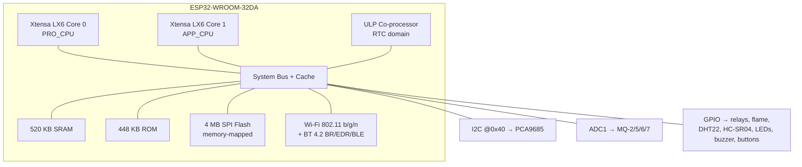
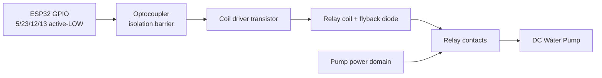

# Chapter 2: Hardware Architecture & Comprehensive Component Specifications

This chapter presents the complete physical platform of the Smart Fire Fighting System (SFFS) at the level of engineering detail required to reproduce, analyse, and validate the design. It proceeds from the central processing unit and its resource constraints, through the chemical, optical, environmental, and acoustic perception devices, to the actuation subsystem that effects suppression, and concludes with a consolidated specifications matrix and an analysis of the physical prototype. Every electrical convention, pin assignment, and parameter stated here is bound strictly to the active production firmware; where a hardware behaviour is dictated by a silicon constraint, that constraint is made explicit because it determines the design rather than merely describing it.

## 2.1 Central Processing Unit and Core Architecture

### 2.1.1 Microcontroller Technical Profile

The computational and control nucleus of the SFFS is the **ESP32-WROOM-32DA** system-in-package module, built around the Espressif ESP32 SoC. The processing core is a **Tensilica Xtensa LX6 dual-core 32-bit** microprocessor, with the two harts conventionally designated PRO_CPU (protocol/core 0) and APP_CPU (application/core 1). Each core is independently clockable, and at the maximum operating frequency of **240 MHz** the device delivers a combined computing capacity of up to approximately **600 DMIPS** (Dhrystone MIPS). The dual-core organization is architecturally significant for this application: it permits the time-critical control and the network/telemetry workload to execute with reduced mutual interference, since the Arduino-framework loop and the WiFi/MQTT protocol stack can be scheduled across the two cores by the underlying FreeRTOS kernel.

Complementing the main cores is an **Ultra-Low-Power (ULP) co-processor**, a small finite-state-machine/RISC-class processor resident in the RTC power domain. The ULP can sample peripherals and perform threshold logic while the main cores are in deep sleep, enabling event-driven wake-up. Although the SFFS operates as a mains-powered, always-on safety appliance and therefore does not exploit deep-sleep duty cycling in normal service, the presence of the ULP and the RTC domain is documented here because it bounds the device's low-power design envelope and the persistence of RTC-domain memory across resets.

The "DA" suffix denotes the dual-antenna variant: the module exposes both an on-board PCB antenna and a connection for an external (IPEX/U.FL) antenna, with antenna-diversity switching. In a structural fire-protection enclosure — typically metallic or containing significant conductive mass — antenna diversity materially improves the robustness of the 2.4 GHz link by mitigating multipath nulls, which is directly relevant to the reliability of the MQTT telemetry channel.

### 2.1.2 Memory and Wireless Topology

The ESP32 integrates a heterogeneous on-chip memory hierarchy. The internal mask **ROM is 448 KB**, holding the first-stage boot code and a body of library routines callable by application firmware. The internal **SRAM totals 520 KB**, partitioned across instruction-bus (IRAM) and data-bus (DRAM) regions, with an additional small **RTC SRAM** (a fast 8 KB block and a slow 8 KB block) located in the always-on RTC domain for ULP use and for state that must survive deep sleep. Program storage and read-only data reside in an **external 4 MB SPI flash** device internal to the WROOM module; this flash is memory-mapped into the CPU address space through the SoC's cache, so executable code and constant data are transparently fetched (execute-in-place) under cache control. The flash partitioning for this project follows the standard Arduino/PlatformIO scheme — a bootloader region, a partition table, the application image, and a non-volatile-storage (NVS) area — with the firmware image well within the available capacity.

The integrated radio subsystem provides **802.11 b/g/n Wi-Fi** in the 2.4 GHz band, with the complete MAC, baseband (BB), and RF front-end integrated on-die; the firmware uses this in station mode to join the local WLAN and reach the MQTT broker. The module additionally integrates **Bluetooth v4.2 BR/EDR and BLE**, sharing the 2.4 GHz radio with the Wi-Fi MAC through a coexistence arbiter. Bluetooth is not used in the SFFS service path, but the shared-radio coexistence is noted because it constrains the RF duty available to Wi-Fi and reinforces the importance of antenna diversity for link margin.

A consequence of the integrated radio that *directly dictates the pin map* is the behaviour of the SoC's two SAR ADC controllers. **ADC2 is shared with the Wi-Fi driver and is unavailable for application analog sampling whenever the radio is active.** Because the SFFS samples four analog gas sensors continuously while the Wi-Fi link is up, all four gas channels are placed on **ADC1**, which is unaffected by radio activity. This single constraint is the governing reason for the gas-sensor pin assignments documented below; it is not a stylistic choice but an electrical necessity.

**Figure 2.1:** Functional architecture of the ESP32-WROOM-32DA showing the dual LX6 cores, ULP co-processor, memory hierarchy, integrated radio, and the project's peripheral interfaces. ADC1 is selected for all gas sensing because ADC2 is reserved by the active Wi-Fi radio.

### 2.1.3 Pinout and Peripheral Mapping

Table 2.1 maps every project interface to its exact physical GPIO, together with the electrical mode and convention enforced in firmware. The assignment respects the SoC's special-pin restrictions: GPIO 6–11 are reserved for the SPI flash and are never used; GPIO 34, 35, 36 (VP), and 39 (VN) are input-only and therefore carry input signals exclusively; GPIO 12 is a boot strapping pin (MTDI) and is treated with the precaution noted in the table.

| Interface | Physical GPIO | Mode / Direction | Electrical convention |
|---|---|---|---|
| I²C SDA (→ PCA9685) | 21 | I²C data, open-drain | Dedicated bus, 400 kHz |
| I²C SCL (→ PCA9685) | 22 | I²C clock, open-drain | Dedicated bus, 400 kHz |
| MQ-2 analog (Room 1) | 32 | Analog in, ADC1_CH4 | 12-bit, 0–3.3 V (11 dB att.) |
| MQ-5 analog (Room 2) | 33 | Analog in, ADC1_CH5 | 12-bit, 0–3.3 V |
| MQ-6 analog (Room 3) | 34 | Analog in, ADC1_CH6 (input-only) | 12-bit, 0–3.3 V |
| MQ-7 analog (Room 4) | 35 | Analog in, ADC1_CH7 (input-only) | 12-bit, 0–3.3 V |
| IR flame digital | 27 | Digital in, `INPUT_PULLUP` | Active-LOW (LOW = flame) |
| DHT22 data | 26 | Digital I/O, single-wire | Bidirectional, ~2 s sampling |
| HC-SR04 trigger | 15 | Digital out | 10 µs trigger pulse |
| HC-SR04 echo | 36 | Digital in (VP, input-only) | 5 V→3.3 V divider required |
| Pump 1 relay (Room 1) | 5 | Digital out | Active-LOW (LOW = ON) |
| Pump 2 relay (Room 2) | 23 | Digital out | Active-LOW |
| Pump 3 relay (Room 3) | 12 | Digital out | Active-LOW · strapping pin (ext. pull-down) |
| Pump 4 relay (Room 4) | 13 | Digital out | Active-LOW |
| Green status LED (SAFE) | 18 | Digital out | Active-HIGH |
| Red status LED (FIRE) | 25 | Digital out | Active-HIGH |
| Siren buzzer | 4 | Digital out | Active-HIGH (continuous on fire) |
| Manual button (Room 1) | 16 | Digital in, `INPUT_PULLDOWN` | Active-HIGH |
| Manual button (Room 2) | 17 | Digital in, `INPUT_PULLDOWN` | Active-HIGH |
| Manual button (Room 3) | 14 | Digital in, `INPUT_PULLDOWN` | Active-HIGH |
| Manual button (Room 4) | 19 | Digital in, `INPUT_PULLDOWN` | Active-HIGH |
| Boot indicator LED | 2 | Digital out | Built-in, boot only |

**Table 2.1:** Complete project pin map binding each SFFS hardware interface to its physical ESP32 GPIO, direction/mode, and electrical convention.

### 2.1.4 Legacy Exclusions

For documentary completeness and to prevent reintroduction of superseded hardware, the following components — present in earlier preliminary materials — are explicitly **excluded** from the architecture and appear nowhere in the implemented system: the GSM SIM800L cellular module, the MPU6050 accelerometer/gyroscope, the ACS712 current sensor, PIR motion sensors, and thermal cameras. Occupancy awareness, formerly attributed to PIR/thermal sensing, is instead provided by the computer-vision line-crossing tracker described in Chapter 3.

## 2.2 Semiconductor Gas and Smoke Perception Array

### 2.2.1 Chemical Dynamics and Surface Phenomena

All four MQ devices are heated **tin-dioxide (SnO₂)** semiconductor chemiresistors, and their operation is governed by oxygen-mediated surface conductance modulation. The sensing element is a porous polycrystalline SnO₂ film maintained at an elevated operating temperature (typically 200–400 °C) by an integral heater coil. In clean air, ambient oxygen chemisorbs onto the SnO₂ grain surfaces and abstracts electrons from the conduction band, forming ionized species ($\mathrm{O_2^-}$, $\mathrm{O^-}$, $\mathrm{O^{2-}}$ depending on temperature):

$$
\mathrm{O_2(gas)} + e^- \rightarrow \mathrm{O_2^-(ads)}, \qquad
\mathrm{O_2^-(ads)} + e^- \rightarrow 2\,\mathrm{O^-(ads)}.
$$

This electron abstraction creates an electron-depletion layer at the inter-grain boundaries and raises the inter-grain potential barrier $eV_s$. Because conduction across the polycrystalline network proceeds by thermionic emission over these barriers, the film conductance follows a thermally activated law,

$$
\sigma \;\propto\; \exp\!\left(-\frac{eV_s}{k_B T}\right),
$$

so the chemisorbed-oxygen state corresponds to a **high barrier and high resistance** $R_s$. When a **reducing target gas** (CO, H₂, CH₄, LPG vapour) reaches the heated surface, it reacts with the adsorbed oxygen ions, for example $\mathrm{CO + O^-(ads) \rightarrow CO_2 + e^-}$, returning the trapped electrons to the conduction band, lowering the barrier $eV_s$, and therefore **reducing the sensor resistance**. The dependence of resistance on gas concentration $C$ is, over the device's working range, an empirical power law

$$
\frac{R_s}{R_0} \;=\; a\,C^{\,b}, \qquad b<0,
$$

where $R_0$ is the clean-air baseline and $a,b$ are gas- and device-specific. The sensitivity is conventionally reported as the ratio $R_s(\text{air})/R_s(\text{gas})$. Because the baseline $R_0$ is established only once the heater has reached its set-point and the surface oxygen population has equilibrated, the firmware enforces a 60-second warm-up gate during which gas readings are excluded from the fire decision — a direct software accommodation of this surface-chemistry transient.

### 2.2.2 MQ-2 — Smoke, LPG, and Combustible Gases (Room 1)

The MQ-2 is a broad-spectrum combustible-gas and smoke sensor with high sensitivity to LPG, propane, hydrogen, methane, and combustion-aerosol smoke, over a typical detection span on the order of 300–10 000 ppm. Its broad sensitivity profile makes it the appropriate general-purpose sentinel for Room 1: it responds both to the particulate-and-volatile signature of incipient smouldering combustion and to leaked combustible gas, giving the widest single-sensor coverage of the four channels. Its analog output is digitized on ADC1_CH4 (GPIO 32) and compared, after exponential smoothing, against the unified `GAS_THRESHOLD` of 2000 counts.

### 2.2.3 MQ-5 — LPG, Natural Gas, and Methane (Room 2)

The MQ-5 is optimized for LPG and natural gas, with strong selectivity toward **methane (CH₄)** — the principal constituent of piped natural gas. Methane's molecular detection proceeds by the same reducing-gas mechanism, with the CH₄ molecule undergoing catalytic oxidation at the SnO₂ surface and liberating conduction electrons. Its placement in Room 2 targets natural-gas-supplied zones, where methane accumulation toward its ≈5 % lower flammable limit constitutes the dominant deflagration risk; the sensor is read on ADC1_CH5 (GPIO 33).

### 2.2.4 MQ-6 — Iso-butane and Propane (Room 3)

The MQ-6 is tuned for LPG constituents, with particular sensitivity to **iso-butane** and **propane**. These heavier-than-air hydrocarbons pool near floor level when leaked, and the MQ-6's response characteristic is well matched to the concentration regime preceding their flammable window. Assigned to Room 3 and read on ADC1_CH6 (GPIO 34, input-only), it provides the propane/butane-specific channel that complements the broader MQ-2 and the methane-leaning MQ-5.

### 2.2.5 MQ-7 — Carbon Monoxide via Thermal-Cycle Detection (Room 4)

The MQ-7 is the carbon-monoxide channel and is unique among the four in that its *designed* operating mode is a **dual-temperature thermal cycle** rather than a constant heater drive. In the canonical cycle the heater is driven in two alternating phases: a **high-voltage phase** (≈5 V for ≈60 s) that raises the SnO₂ to a high temperature to thermally desorb and clean accumulated species and re-establish the surface, followed by a **low-voltage phase** (≈1.4 V for ≈90 s) that lowers the temperature into the regime where CO adsorption dominates and the measurement is taken. This cycling is what gives the MQ-7 its CO selectivity: CO is read during the low-temperature window while interfering gases are burned off during the high-temperature window. In the present implementation the sensor's conditioned analog output is sampled continuously on ADC1_CH7 (GPIO 35, input-only) and smoothed identically to the other channels; the thermal-cycle mechanism is documented here because it defines the device's intrinsic CO-detection physics and its response latency, both of which are relevant to interpreting the Room 4 CO telemetry.

### 2.2.6 Electrical Conditioning and ADC Mapping

Each MQ module presents its sensing resistance $R_s$ in series with a fixed **load resistor $R_L$**, forming a voltage divider across the heater/sensor supply $V_c$. The analog output presented to the ESP32 is the divider node voltage

$$
V_{\text{out}} \;=\; V_c\,\frac{R_L}{R_s + R_L}.
$$

As $R_s$ falls under reducing-gas exposure, $V_{\text{out}}$ rises monotonically, so increasing gas concentration maps to an increasing ADC code. The ESP32's SAR ADC quantizes this voltage to a **12-bit code** $g \in [0,4095]$. To accommodate the full $0\text{–}3.3\,\text{V}$ input span, each channel is configured with the **11 dB input attenuation** setting, which extends the ADC's usable full-scale to approximately the supply rail (the ESP32 ADC is non-linear near its extremes, but the 2000-count operating threshold lies in the well-behaved mid-range). Because raw MQ modules nominally swing toward 5 V, the analog node must be scaled to remain within the 3.3 V ADC limit; this is handled at the module/divider level so that the signal delivered to GPIO 32–35 never exceeds the ADC's tolerance. The four conditioned streams are then filtered by the first-order exponential moving average ($\alpha = 0.15$) before thresholding, attenuating SAR quantization noise and sensor flicker without introducing the latency of a long moving-average window.

| Sensor | ADC1 channel | GPIO | Room | Principal targets |
|---|---|---|---|---|
| MQ-2 | CH4 | 32 | 1 | Smoke, LPG, propane, H₂ (broad) |
| MQ-5 | CH5 | 33 | 2 | LPG, natural gas, methane (CH₄) |
| MQ-6 | CH6 | 34 | 3 | LPG, iso-butane, propane |
| MQ-7 | CH7 | 35 | 4 | Carbon monoxide (CO) |

**Table 2.2:** Mapping of the MQ semiconductor array to ESP32 ADC1 channels (all input-capable, radio-immune) with per-room target species.

## 2.3 Localized Environmental and Optical Flame Detection

### 2.3.1 Optical IR Flame Sensor Array

The optical detection channel is an **infrared flame sensor** built around an IR-sensitive photodiode whose spectral responsivity is concentrated in the **760–1100 nm** near-infrared band. This band is selected because hydrocarbon combustion emits strongly there — both as broadband thermal radiation and via characteristic emission features — so an IR photodiode discriminates flame radiation from much of the visible-light background. The photodiode current is converted to a voltage and presented to an **LM393 voltage comparator**, whose reference (threshold) is set by an on-board trimmer potentiometer. When the IR flux exceeds the reference, the comparator output transitions; the module is wired so that the digital output (DO) is **active-LOW**, i.e. it drives the line LOW upon flame detection. The DO connects to ESP32 GPIO 27 configured as `INPUT_PULLUP`, so the idle (no-flame) state is held HIGH by the internal pull-up and a detected flame pulls it LOW, satisfying the firmware predicate `digitalRead(FLAME_PIN) == LOW ⇒ fire`. Because the comparator output is a fast digital decision rather than an analog level, the flame channel provides a low-latency, illumination-robust confirmation that is electrically and physically orthogonal to the chemical channels, and in the control law it acts as a structure-wide (global) emergency override.

### 2.3.2 DHT22 Thermohygrometric Sensor

The **DHT22** (AM2302) provides calibrated temperature and relative-humidity telemetry over a single data line on GPIO 26. Humidity is transduced by a **capacitive sensing element** — a hygroscopic dielectric between two electrodes whose capacitance varies with absorbed water vapour — while temperature is transduced by a **negative-temperature-coefficient (NTC) thermistor** whose resistance falls with rising temperature. The device covers approximately −40 to +80 °C (±0.5 °C) and 0–100 % RH (±2–5 %). Communication uses a **proprietary single-bus synchronous protocol** with strict timing: the host pulls the line low for at least ~1 ms to request a sample, releases it, and the sensor answers with an ~80 µs low followed by an ~80 µs high, then streams 40 bits — 16 bits humidity, 16 bits temperature, 8 bits checksum. Each bit is encoded by a fixed ~50 µs low followed by a high whose duration distinguishes the symbol: a short high (~26–28 µs) denotes logic 0 and a long high (~70 µs) denotes logic 1. The protocol mandates a minimum inter-sample interval of roughly 2 s, which the firmware honours by rate-limiting DHT reads; the temperature and humidity contextualize the gas baselines (metal-oxide sensors are humidity-sensitive) and feed the telemetry stream.

### 2.3.3 HC-SR04 Ultrasonic Telemetry Sensor

Water-tank level is monitored by an **HC-SR04 ultrasonic ranging sensor** operating on the time-of-flight principle. A transmit transducer emits a burst of eight cycles at **40 kHz** when the host applies a 10 µs HIGH pulse to the TRIG line (GPIO 15); a receive transducer detects the returning echo and the module asserts its ECHO line HIGH for a duration equal to the acoustic round-trip time $\Delta t$. The one-way distance to the water surface is then

$$
d \;=\; \frac{c\,\Delta t}{2}, \qquad c \approx 343\ \text{m·s}^{-1}\ \text{(at 20 °C)},
$$

and the tank fill level is derived from the geometry as a percentage of the known tank height $H$:

$$
\text{level\%} \;=\; \frac{H - d}{H}\times 100\%.
$$

The firmware bounds the echo wait with a timeout (25 000 µs, corresponding to a maximum range of a few metres) so a missing echo cannot stall the control loop, and applies the same exponential smoothing to the distance estimate. Because the ECHO line idles and pulses at 5 V logic while the ESP32 GPIO is 3.3 V-tolerant only, a resistive **5 V→3.3 V divider** is mandatory on the ECHO conductor into GPIO 36; the TRIG output requires no such conditioning. The resulting level estimate drives the pump dry-run hysteresis (cut below 10 %, resume at ≥ 20 %).

## 2.4 Multi-Zone Spatial Actuation and Servo Suppression Kinematics

### 2.4.1 PCA9685 16-Channel 12-bit PWM Driver

All servo timing is delegated to a dedicated **PCA9685** PWM controller, communicating with the ESP32 over a private **I²C** bus in **400 kHz Fast-mode** (SDA = GPIO 21, SCL = GPIO 22). The device provides **16 independent channels** each with **12-bit resolution** ($2^{12} = 4096$ steps), generated from a single on-chip oscillator and a programmable prescaler, so that all nine servos are refreshed from one coherent time base without consuming any of the MCU's own timers. The output frequency is set by writing the PRESCALE register according to

$$
\text{prescale} \;=\; \operatorname{round}\!\left(\frac{f_{\text{osc}}}{4096 \times f_{\text{PWM}}}\right) - 1,
$$

and for $f_{\text{PWM}} = 50\ \text{Hz}$ with the firmware's calibrated oscillator value this yields the standard 20 ms servo frame. Each channel's high-time is programmed by 12-bit ON/OFF count registers, so the pulse width is

$$
t_{\text{high}} \;=\; \frac{\text{count}}{4096}\times T, \qquad T = 20\ \text{ms},
$$

giving a per-count resolution of $T/4096 \approx 4.88\ \mu\text{s}$. The device is addressed at the **hardcoded I²C address 0x40** (all hardware address-select pins A0–A5 left unbridged); the bus is kept private to the PCA9685 so that no other peripheral can perturb the servo refresh timing.

### 2.4.2 Zonal SG90 Servo Actuation Array

The nine actuators are **SG90-class** analog micro-servos. An SG90 interprets the high-time of each 50 Hz frame as an angular command over a span of approximately **0.5 ms to 2.5 ms** mapped to **0°–180°**; the firmware drives the tighter, calibrated window of `SERVO_PWM_MIN = 102` to `SERVO_PWM_MAX = 491` counts (≈0.50 ms to ≈2.40 ms), and converts an arbitrary commanded angle $\phi$ linearly:

$$
\text{count}(\phi) \;=\; \text{MIN} + \frac{\phi}{180^{\circ}}\big(\text{MAX} - \text{MIN}\big).
$$

The nine servos are distributed across the four-room topology to perform three distinct classes of mechanical intervention:

- **Gas-valve interdiction (1 servo, channel 0).** A single servo actuates the automated main-line gas cutoff. On any fire condition it rotates from the safe open position (0°) to the fully closed position (180°), mechanically isolating the fuel supply and converting a potential fuel-fed escalation or deflagration into a bounded event.
- **Structural isolation (6 servos, channels 1–6).** Four **door** servos (channels 1–4, one per room) and two **corridor** servos (channels 5–6, ground-floor and first-floor) effect compartmentalization and egress. On a room's fire condition its door opens (0°→90°) to create an escape path, and both corridor barriers open to establish the evacuation route; clear rooms retain their closed safe state to contain smoke migration.
- **Volumetric ventilation (2 servos, channels 7–8).** Two **window** servos (Rooms 3 and 4) provide controlled ventilation actuation. Their convention is inverted relative to the doors: the safe state is open (90°, ventilated) and a *local* fire closes the window (0°) to starve the compartment fire of oxygen — a deliberately different kinematic role from the egress-opening doors.

This kinematic assignment is summarized for reference: channel 0 (valve), 1–4 (doors), 5–6 (corridors), 7–8 (windows). The edge-cached actuation pattern in the firmware ensures each servo receives a new PWM command only when its commanded angle actually changes, eliminating buzz and redundant I²C traffic.

### 2.4.3 4-Channel Relay Control and Inductive Isolation

The four DC water pumps present inductive, comparatively high-current loads that must not be switched directly from a microcontroller GPIO. They are therefore driven through a **4-channel relay module** whose input stage provides **optocoupler isolation**: each channel's control input drives the LED of an opto-isolator (e.g., an 817-class device), and the phototransistor in turn switches the relay-coil driver transistor. This galvanically isolates the ESP32 logic ground from the relay/pump power domain, so that **inductive kickback** — the high-voltage transient generated when current through the pump motor and relay coil is interrupted — cannot propagate back into the MCU. A flyback (freewheeling) diode across each relay coil clamps the coil's own switching transient, while the opto-isolation barrier protects the logic side from the motor-domain transients. The relay control inputs are **active-LOW**: the firmware drives the corresponding GPIO (5, 23, 12, and 13 for Rooms 1–4) **LOW to energize** a pump and HIGH to release it, and preloads the latch HIGH before configuring the pin as an output so no pump can momentarily actuate during boot. GPIO 12, being a boot strapping pin, additionally requires an external pull-down on its relay input so the line reads LOW at reset and the module boots reliably.

Two further actuator classes are driven **directly** from low-current GPIO rather than through the relay bank, because their current draw is within the MCU's per-pin limit: the **siren buzzer** (an active buzzer on GPIO 4, sounded continuously during any fire) and the two **status LEDs** (green/SAFE on GPIO 18 and red/FIRE on GPIO 25, each through a series current-limiting resistor). This division — inductive pump loads behind opto-isolated relays, low-current annunciators on direct GPIO — is the correct engineering partition of the actuation interface.

**Figure 2.2:** Opto-isolated relay channel. The optocoupler galvanically separates the ESP32 logic domain from the pump power domain; the flyback diode clamps coil inductive kickback.

## 2.5 Hardware Component Specifications Matrix

Table 2.3 consolidates the principal electrical and environmental parameters of every component in the authoritative hardware set. Currents are representative peak (worst-case operational) figures referred to the component's own supply; the system-level aggregation and supply sizing are treated in the power-budget analysis.

| Component | Operating voltage | Peak current | Signalling protocol | Operating temperature |
|---|---|---|---|---|
| ESP32-WROOM-32DA | 3.0–3.6 V (3.3 V) | ~240 mA (Wi-Fi TX burst) | — (host) | −40 to +85 °C |
| MQ-2 (smoke/LPG) | 5 V | ~150 mA (heater) | Analog | −10 to +50 °C |
| MQ-5 (LPG/CH₄) | 5 V | ~150 mA (heater) | Analog | −10 to +50 °C |
| MQ-6 (LPG/butane) | 5 V | ~150 mA (heater) | Analog | −10 to +50 °C |
| MQ-7 (CO) | 5 V (cycled 5 V/1.4 V) | ~150 mA (heater) | Analog | −10 to +50 °C |
| IR flame sensor (LM393) | 3.3–5 V | ~15–20 mA | Digital (active-LOW) | −25 to +85 °C |
| DHT22 (AM2302) | 3.3–5 V | ~1.5–2.5 mA | One-wire (proprietary) | −40 to +80 °C |
| HC-SR04 ultrasonic | 5 V | ~15 mA (measurement) | Digital (TRIG/ECHO) | −15 to +70 °C |
| PCA9685 PWM driver | 2.3–5.5 V logic; V+ servo rail | ~10 mA (logic) | I²C @ 0x40, 400 kHz | −40 to +85 °C |
| SG90 servo (×9) | 4.8–6 V | ~250 mA moving (~650 mA stall) | PWM (50 Hz) | 0 to +55 °C |
| 4-channel relay module | 5 V | ~70–80 mA per active channel | Digital (active-LOW, opto-isolated) | −25 to +70 °C |
| DC water pump (×4) | 3–6 V | ~150–300 mA (loaded) | Relay-switched | 0 to +60 °C |
| Active siren buzzer | 3.3–5 V | ~25–30 mA | Digital (active-HIGH) | −20 to +60 °C |
| Status LED (×2) | 3.3 V (via $R$) | ~20 mA each | Digital (active-HIGH) | −40 to +85 °C |

**Table 2.3:** Master engineering specifications matrix for the authoritative SFFS hardware set.

## 2.6 Physical Prototype Layout and Spatial Constraints

The following figures document the assembled physical prototype (the structural demonstrator enclosure) from multiple orthographic and oblique viewpoints. Together they establish the spatial relationships between the perception devices, the PCA9685-driven servo bank, the relay/pump subsystem, and the ESP32 controller, and they illustrate the layout decisions taken to manage signal integrity within a compact, electrically noisy enclosure.

The front elevation establishes the four-room organization of the demonstrator and the placement of the door-actuation servos along the accessible façade, where their mechanical travel is unobstructed. The status LEDs and buzzer are mounted front-facing for direct operator visibility and audibility, consistent with their role as human-facing annunciators. The MQ gas sensors are distributed one per room behind the façade so that each compartment's atmosphere is sampled locally rather than at a shared manifold. Routing of the low-voltage analog gas lines is kept short and direct to the controller to minimize the loop area available for capacitive and inductive pickup.

The corner view reveals the depth-wise stratification of the electronics, with the ESP32 controller and the PCA9685 PWM driver grouped on the logic plane and the relay/pump subsystem set apart on a separate plane. This physical separation between the sensitive logic/PWM domain and the switching power domain is a deliberate electromagnetic-interference (EMI) mitigation, increasing the distance between the relay-switching transients and the analog/I²C signal paths. The dedicated I²C run from the ESP32 to the PCA9685 is kept short to preserve signal integrity at the 400 kHz bus rate. The oblique perspective also shows the servo harness fanning out from the PWM driver toward the distributed actuators, with the harness routed away from the relay wiring.

The top plan view makes explicit the proximity of the four compartments and the placement of the two corridor servos along the inter-room boundaries that they compartmentalize. A central wiring spine aggregates the sensor returns and actuator drives, which both shortens conductor runs and concentrates the harness away from the room volumes where the gas sensors operate. The orthogonal crossing of power and signal conductors, where unavoidable, follows the standard practice of crossing at right angles to minimize inductive coupling. The plan layout confirms that each pump is co-located with the room it serves, eliminating the long shared runs that a centralized topology would impose.

The right-side elevation details the vertical arrangement of the window-ventilation servos and the suppression plumbing, with the window actuators positioned at the upper compartment boundary consistent with their oxygen-management role. Mounting the inductive pump loads low and apart from the upper-mounted sensors increases the physical separation between the motor-noise sources and the susceptible analog front ends. The vertical layout also keeps the high-current pump supply conductors on a distinct plane from the 3.3 V logic and the ADC inputs. This stratified elevation reduces conducted and radiated coupling from the switching loads into the perception channels.

The rear elevation concentrates the power-entry and the four-channel relay bank, deliberately segregating the high-current switching domain to the back of the enclosure and away from the front-mounted sensors and indicators. Locating the relays adjacent to the power entry shortens the high-current conductors and confines their return currents to a compact region, limiting the area over which their magnetic fields can couple into signal lines. The opto-isolated relay inputs receive only the low-current GPIO control lines from the controller, so the control wiring crossing into the power domain carries negligible current. The rear placement completes the front-to-back partition between the human-facing/perception subsystem and the actuation/power subsystem that underlies the enclosure's EMI strategy.
