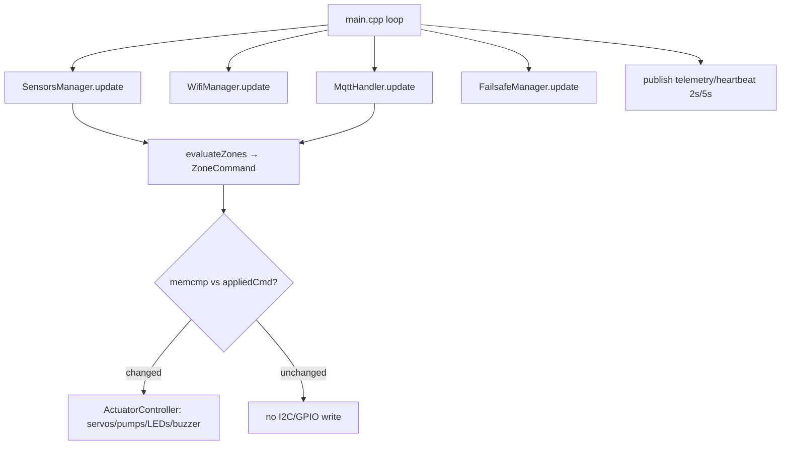
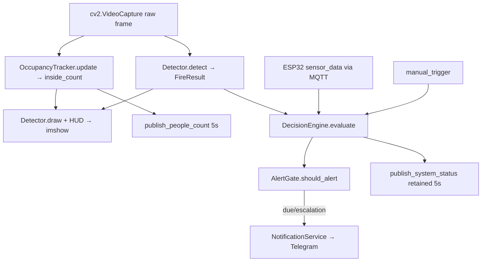

# Chapter 3: Full System Integration & Implementation

This chapter documents the assembly of the components specified in Chapter 2 into a single, coherent, operational system. It moves from the unified electrical interconnection topology, through the object-oriented embedded firmware that governs the edge controller, to the MQTT middleware that binds the controller to the perception tier, the Node-RED operator interface, and finally the GPU-accelerated computer-vision pipeline and its alerting automation. Every algorithm, parameter, class abstraction, and message schema described here is extracted directly from the active production codebase (`src/`, `include/`, `platformio.ini`, `config.h`, and the Python `src/`), which is the authoritative source of truth; legacy elements (SIM800L, MPU6050, ACS712, PIR, thermal cameras) are excluded throughout.

## 3.1 Unified Electrical Schematics and Interconnection Topology

### 3.1.1 Power Distribution Network

The SFFS is organized around two regulated DC rails with a single common ground reference. The **5 V rail** is the primary system bus; it powers the gas-sensor heaters, the HC-SR04, the active buzzer, and — through the PCA9685's V+ terminal — the nine servos and, through the relay-switched domain, the four pumps. The **3.3 V rail** is generated locally by the ESP32 module's on-board AMS1117 linear regulator from the 5 V input and powers only the MCU core, the PCA9685 logic side, the DHT22, and the digital inputs; it is therefore a low-current rail whose draw is already subsumed in the ESP32's 5 V figure.

Current budgeting for the rail is dominated by three concurrent worst-case loads that coincide at a global-fire transition: the simultaneous slew of nine servos, the activation of the four pumps, and the always-on gas-sensor heaters. Using the per-unit figures of Chapter 2, the operational worst case is

$$
I_{5\text{V}} \approx \underbrace{9\times250\,\text{mA}}_{\text{servo slew}} + \underbrace{4\times220\,\text{mA}}_{\text{pumps}} + \underbrace{4\times150\,\text{mA}}_{\text{MQ heaters}} + \underbrace{240\,\text{mA}}_{\text{ESP32 TX}} + \text{misc} \approx 4.1\,\text{A},
$$

which, with a 20 % engineering margin, mandates a **5 V / 5 A** supply. Because nine servos slewing together present a sub-second inrush capable of collapsing the rail, the servo V+ is taken from an **isolated high-current branch** with a bulk electrolytic reservoir (≥ 2200 µF) at the PCA9685, decoupling the actuator transient from the logic domain.

| Rail | Source | Principal loads | Worst-case current |
|---|---|---|---|
| 5 V system bus | External 5 V/5 A supply | MQ heaters, servos (via PCA9685 V+), pumps (via relays), HC-SR04, buzzer | ≈ 4.1 A operational |
| 3.3 V logic | ESP32 on-board AMS1117 | MCU core/radio, PCA9685 logic, DHT22, digital inputs | ≈ 0.1 A (excl. radio) |

**Table 3.1:** Power-rail partition and worst-case current budget for the integrated system.

**Common-ground noise mitigation.** All grounds — logic, servo V+, relay/pump, and sensor — are referenced to a single **star ground** point. This single-point return prevents the high di/dt pump and servo currents from developing voltage differentials across shared ground traces that would otherwise couple into the analog gas measurements and the I²C bus. The high-current pump returns are kept on dedicated, short conductors so that their return current does not share a path with the ADC reference, which is the dominant source of conducted noise in a mixed motor/analog system.

### 3.1.2 Bus Topologies

**I²C physical layer (ESP32 ↔ PCA9685).** The servo driver communicates over a dedicated I²C bus on GPIO 21 (SDA) and GPIO 22 (SCL) at **400 kHz Fast-mode**. I²C lines are open-drain and therefore require pull-up resistors $R_p$ to the logic supply; their value is bounded on both sides. The minimum is set by the drivers' sink capability, $R_{p,\min} = (V_{DD}-V_{OL})/I_{OL}$, and the maximum by the bus rise-time limit, which for Fast-mode requires $t_r \le 300\,\text{ns}$:

$$
R_{p,\max} \;=\; \frac{t_r}{0.8473\,C_b},
$$

where $C_b$ is the total bus capacitance (bounded to 400 pF in Fast-mode). For the short, lightly-loaded dedicated run used here, pull-ups in the **2.2–4.7 kΩ** range satisfy both bounds; the PCA9685 breakout provides on-board pull-ups sized for this regime. Keeping the bus private to the PCA9685 minimizes $C_b$ and eliminates contention that could perturb the 50 Hz servo refresh.

**One-Wire signalling (DHT22).** The DHT22 uses a single bidirectional data conductor on GPIO 26 with a pull-up resistor that holds the idle line HIGH. The host and sensor alternate as driver on the same wire under the strict start/response/40-bit timing protocol detailed in Chapter 2; the firmware honours the mandated ≥ 2 s inter-sample interval so the bus is never over-polled.

### 3.1.3 Actuator Isolation Layout

The four pumps are inductive loads switched through a **4-channel relay module** whose input stage is **opto-isolated**. Each control line drives the LED of an opto-coupler; its phototransistor switches the relay-coil driver, so the ESP32 logic ground is galvanically separated from the relay/pump power domain. This barrier is the principal defence against the **inductive counter-EMF (back-EMF)** generated when the current through a pump motor and relay coil is interrupted: without isolation, the resulting high-voltage transient can inject into the MCU supply and provoke a brown-out **micro-reset**. A flyback (freewheeling) diode across each relay coil clamps the coil's own switching spike, while the opto-barrier blocks motor-domain transients from the logic side. The relay inputs are **active-LOW** (firmware drives the GPIO LOW to energize), and the firmware preloads each latch HIGH before configuring the pin as an output so no pump actuates during boot. GPIO 12 (Pump 3) additionally carries an external pull-down because it is a boot strapping pin.

## 3.2 Modular Firmware Engineering (PlatformIO C++)

The firmware is an object-oriented PlatformIO/Arduino-framework project. Its dependencies are declared in `platformio.ini` — `knolleary/PubSubClient` (MQTT), `bblanchon/ArduinoJson` (serialization), `adafruit/Adafruit PWM Servo Driver Library` (PCA9685), and `adafruit/DHT sensor library` with `adafruit/Adafruit Unified Sensor`. The architecture decomposes the system into five single-responsibility classes, each declared in `include/` and implemented in `src/`, instantiated as global objects and coordinated by a non-blocking cooperative loop in `main.cpp`. The loop never blocks on I/O: each module exposes an `update()` method that performs a bounded slice of work per iteration, so the control cycle remains deterministic.



**Figure 3.1:** Firmware module orchestration and the edge-cached, level-driven control cycle. Hardware is written only when the recomputed `ZoneCommand` differs from the last applied command.

| Module (`.h`/`.cpp`) | Class | Single responsibility |
|---|---|---|
| `wifi_manager` | `WifiManager` | Station-mode connection + non-blocking reconnect |
| `sensors` | `SensorsManager` | ADC1 gas, flame, DHT22, HC-SR04, buttons; filtering |
| `mqtt_handler` | `MqttHandler` | Broker I/O, command parsing, telemetry publishing |
| `actuators` | `ActuatorController` | PCA9685 servos, pump relays, LEDs, buzzer |
| `failsafe` | `FailsafeManager` | Connectivity-state classification for telemetry |

**Table 3.2:** Firmware module decomposition and responsibilities.

### 3.2.1 `wifi_manager` — Non-Blocking Connection Management

`WifiManager(ssid, password, retryDelay)` configures the radio for **station mode** (`WIFI_STA`) and enables the ESP32's hardware-level auto-reconnect (`WiFi.setAutoReconnect(true)`). Its `begin()` performs a *bounded blocking* initial connection — polling `WiFi.status()` for at most 10 s at boot so that the device reaches the network before entering service — after which all connection maintenance is **non-blocking**. The `update()` method, called every loop, implements a small transition-detecting state machine using a `_wasConnected` flag: on a HIGH→LOW transition it logs the loss and timestamps it; while disconnected it issues a `WiFi.disconnect()`/`WiFi.begin()` retry no more often than every `retryDelay` (5 s); and on a LOW→HIGH transition it logs reconnection and the reacquired IP. The class exposes `isConnected()`, `getRSSI()` (signal strength in dBm, surfaced to telemetry), and `getIP()`. Because the retry cadence is rate-limited and never spins, WiFi maintenance consumes negligible loop time and cannot stall suppression.

### 3.2.2 `sensors` — Cyclic Non-Blocking Acquisition and Filtering

`SensorsManager` owns all perception inputs. Its constructor instantiates four exponential-moving-average filters (`EmaFilter`, $\alpha = 0.15$), one per MQ channel, plus a fifth for the ultrasonic distance. `begin()` configures pin modes (analog inputs on GPIO 32–35, `INPUT_PULLUP` flame on 27, `INPUT_PULLDOWN` buttons on 16/17/14/19, TRIG/ECHO on 15/36), starts the DHT22, and records the boot time for the warm-up gate. The `update()` method executes a fixed cyclic sequence each loop, all non-blocking:

1. **Gas acquisition.** The four ADC1 channels are read and passed through their EMA filters, $\hat{g}[n] = \alpha\,g[n] + (1-\alpha)\,\hat{g}[n-1]$, attenuating SAR noise without long-window latency.
2. **Flame.** `digitalRead(FLAME_PIN) == LOW` yields the active-LOW flame boolean.
3. **DHT22.** Reads are **rate-limited to ≥ 2 s** and **NaN-guarded**: a failed read retains the last valid value rather than corrupting telemetry.
4. **Warm-up gate.** A boolean latches true once 60 s (`SENSOR_WARMUP_MS`) have elapsed; until then gas readings are excluded from the fire decision.
5. **Ultrasonic.** Every 500 ms a 10 µs trigger is issued and `pulseIn()` captures the echo high-time under a **bounded 25 000 µs timeout** so a missing echo cannot stall the loop; the distance is filtered and converted to a tank percentage.
6. **Buttons.** The four manual buttons are sampled and **debounced over a 300 ms window** before their states are published.

Accessors (`getGas(roomIdx)`, `getTemperature()`, `getHumidity()`, `isFlameDetected()`, `isWarmedUp()`, `getWaterLevelPct()`, `isButtonPressed(roomIdx)`) expose the conditioned values to the control loop.

### 3.2.3 `mqtt_handler` — M2M Bridge and Serialization

`MqttHandler(broker, port, clientId)` wraps a `PubSubClient` over a `WiFiClient`. `begin()` configures the server, the message callback, a 512-byte buffer (`JSON_BUFFER_SIZE`), a 60 s keep-alive, and a **2 s socket timeout** that bounds PubSubClient's blocking. The private `_attemptConnect()` connects with a **Last-Will-and-Testament**: a retained `{"status":"offline"}` registered on the heartbeat topic so the broker flags the node offline on an ungraceful drop, after which it subscribes to the command topic `sffs/system/status` at **QoS 1**. The `update()` method services the client when connected; when disconnected it **clears the AI fire override** (`_fireCommanded = false`, so a stale command cannot persist across a link loss) and performs **exponential-backoff reconnection** bounded between 5 s and 30 s. The message callback `_handleMessage()` deserializes the command payload with ArduinoJson and extracts only the `state` and `confidence` fields, setting `_fireCommanded` true iff `state == "FIRE"` — the per-zone actuation is computed locally, so the command's `actions` block is not consumed. Publishing methods serialize the telemetry (`publishSensorData`), liveness (`publishHeartbeat`), and per-room button edges (`publishManualAlarm`) as compact JSON, all guarded by a connection check so they are no-ops when offline.

### 3.2.4 `actuators` — PCA9685 Servo Driver and Relay Execution

`ActuatorController` centralizes all output. `begin()` brings up the I²C bus at 400 kHz, **probes** the PCA9685 at 0x40 (logging a loud diagnostic if the device NACKs), sets the calibrated oscillator and the 50 Hz refresh, preloads the four pump relays HIGH (off) before switching them to outputs, configures the LEDs, and calls `setSafeDefaults()` to leave every actuator in the SAFE posture before the loop begins. The core primitive `setServoAngle(channel, angle)` performs the **pulse conversion math** — mapping the angle linearly to the 12-bit count between `SERVO_PWM_MIN` (102 ≈ 0.5 ms) and `SERVO_PWM_MAX` (491 ≈ 2.4 ms) — and is **edge-cached**: it compares the requested angle against a per-channel cache and writes the PCA9685 register only on a change, eliminating redundant I²C traffic and servo chatter. The boolean group methods (`setGasValve`, `setRoomDoor`, `setCorridors`, `setRoomWindow`, `setPump`, `setLeds`, `setBuzzer`) express the zoning semantics; the relay-driven `setPump(roomIdx, on)` writes the active-LOW level (LOW = ON) and is likewise edge-cached, tracking pump state for the water-safety logic.

### 3.2.5 `failsafe` and Edge-Level Autonomy

Two distinct mechanisms provide fault tolerance. The `FailsafeManager` is a lightweight connectivity finite-state machine — `NORMAL → DEGRADED → RECOVERY → NORMAL` — updated each loop with the WiFi and MQTT connection states; it classifies link health and exposes a `mode` string for telemetry but **does not actuate hardware**. The deeper guarantee is architectural and lives in the `main.cpp` control law: the per-room fire predicate

$$
\text{Fire}_r = (\hat{g}_r > \theta_g \wedge W)\ \vee\ \beta_r\ \vee\ F\ \vee\ M
$$

includes three terms — the gas reading $\hat g_r$, the manual button $\beta_r$, and the local flame $F$ — that are **entirely independent of the broker**. Only the fourth term $M$ (the MQTT `FIRE` command) requires connectivity, and it is cleared the instant the link drops. Consequently, if the Mosquitto broker becomes unreachable, the controller continues to detect and suppress fires autonomously from its local sensors; network loss degrades only the remote-confirmation and telemetry functions, never the suppression core. This is the edge-level autonomy that distinguishes the SFFS from cloud-dependent designs.

## 3.3 Middleware Protocol & Machine-to-Machine (M2M) Communication

### 3.3.1 Mosquitto Broker Infrastructure

The two tiers communicate exclusively through a local **Mosquitto** broker configured by `mosquitto.conf` and listening on **`localhost:1883`** under **MQTT v3.1.1**. The AI module connects on the loopback interface; the ESP32 connects to the broker host's LAN IP (set in `secrets.h`). Three independent clients attach to the broker — the ESP32 (`sffs_esp32`), the AI module (`sffs_ai_module`), and the Node-RED dashboard (`nodered_sffs`) — and they never hold direct sockets to one another. This star-of-publishers topology is what permits each participant to fail or restart independently.

### 3.3.2 Zonal Topic Tree Hierarchy

The topic tree is **function-partitioned** rather than room-partitioned: a single telemetry topic carries all four rooms' data within one structured payload, and a single command topic carries the fused system state. Per-room granularity is expressed in the JSON fields of these aggregated messages, which minimizes broker traffic and message overhead relative to sixteen-plus per-room topics. Table 3.3 maps each room onto the function-partitioned tree, and Table 3.4 catalogs the complete topic set with its QoS and retention semantics.

| Room | Telemetry (sensor) | Manual alarm | Control |
|---|---|---|---|
| Room 1 | `sffs/sensors/data` → `gas.mq2` | `sffs/manual/alarm` (`room="Room 1"`) | `sffs/system/status` (global `state`) |
| Room 2 | `sffs/sensors/data` → `gas.mq5` | `sffs/manual/alarm` (`room="Room 2"`) | `sffs/system/status` |
| Room 3 | `sffs/sensors/data` → `gas.mq6` | `sffs/manual/alarm` (`room="Room 3"`) | `sffs/system/status` |
| Room 4 | `sffs/sensors/data` → `gas.mq7` | `sffs/manual/alarm` (`room="Room 4"`) | `sffs/system/status` |

**Table 3.3:** Logical mapping of the four rooms onto the function-partitioned MQTT topic tree.

| Topic | Producer → Consumer | QoS | Retain | Purpose |
|---|---|---|---|---|
| `sffs/sensors/data` | ESP32 → AI, Node-RED | 0 | no | Aggregated sensor telemetry (2 s) |
| `sffs/system/status` | AI → ESP32, Node-RED | 1 | yes | Fused actuator command / state |
| `sffs/system/heartbeat` | ESP32 → AI | 0 | LWT | Liveness; retained offline will |
| `sffs/manual/alarm` | ESP32 → Node-RED | 0 | no | Per-room manual button edges |
| `sffs/ai/status` | AI → all | 1 | yes | AI liveness / LWT (dedicated) |
| `sffs/ai/detection` | AI → Node-RED | 0 | no | Raw fire/smoke detection events |
| `sffs/ai/people_count` | AI → Node-RED | 0 | no | Occupancy count (5 s) |

**Table 3.4:** Complete MQTT topic catalog with direction, QoS, and retention. The AI's LWT resides on the dedicated `sffs/ai/status` topic so an AI crash can never be mis-parsed by the ESP32 as an actuator command.

### 3.3.3 Payload Optimization

Payloads are compact JSON serialized within the ESP32's fixed 512-byte buffer. The **sensor telemetry** schema aggregates all four rooms plus metadata:

```json
{ "ts":12, "gas":{"mq2":512,"mq5":480,"mq6":470,"mq7":505},
  "env":{"temp":24.6,"hum":41.2}, "water":{"level_pct":78.5,"distance_cm":4.3},
  "manual_trigger":0,
  "meta":{"wifi_rssi":-58,"uptime_s":3601,"heap_free":201340,"mode":"NORMAL","flame":false} }
```

The **command/threshold-update** schema published by the AI carries the fused decision:

```json
{ "ts":12, "state":"FIRE", "confidence":0.98, "source":"GAS/SMOKE+FLAME",
  "actions":{"gas_valve":"CLOSE","doors":"OPEN","pump1":"ON","pump2":"ON"} }
```

and the **manual-override actuation** the operator injects from the dashboard reuses the same command schema (e.g. `{"state":"FIRE","source":"DASHBOARD","confidence":1.0}`). Heartbeats (`{"ts":…,"status":"alive"}`), occupancy (`{"ts":…,"inside_count":N}`), and detection events (`{"ts":…,"type":"Fire","confidence":0.9}`) are minimal by design to keep broker throughput low.

## 3.4 Node-RED Control Room Dashboard Implementation

### 3.4.1 Backend Logic Flow Processing

The dashboard is a Node-RED flow whose ingress is an `mqtt-broker` configuration node ("SFFS Mosquitto", `localhost:1883`, protocol version 4 = MQTT 3.1.1, keep-alive 60 s, client `nodered_sffs`). An `mqtt in` node subscribes to the telemetry topic and emits each retained/streamed message as a Node-RED message object whose `payload` is the raw JSON string. A JSON-parse node deserializes it into a JavaScript object, after which **function blocks** route individual fields to their widgets — for example extracting `msg.payload.meta.wifi_rssi`, `msg.payload.meta.heap_free`, `msg.payload.meta.uptime_s`, `msg.payload.water.level_pct`, the four `gas.*` codes, and `env.temp`/`env.hum` into separate outgoing messages keyed to the corresponding UI nodes. Parallel `mqtt in` nodes subscribe to `sffs/ai/people_count`, `sffs/ai/detection`, `sffs/manual/alarm`, and `sffs/system/status`, feeding the occupancy, event-log, manual-alarm, and actuator-status widgets respectively. The egress path is an `mqtt out` node publishing operator commands to `sffs/system/status`.

### 3.4.2 Dashboard Interface Engineering

The interface is a single `ui_tab` named **"SFFS Control Room"** organized into nine `ui_group` panels: **System Status, Gas Sensors, Environment, Occupancy, Actuator Status, ESP32 Health, Event Log, Water Tank,** and **Manual Alarms**. The **ESP32 Health** group renders real-time gauges for WiFi RSSI (dBm), free-heap memory (bytes, monitored for long-run stability — a flat trace evidences the absence of memory leaks), and uptime. The **Gas Sensors** and **Environment** groups present per-room gas gauges and temperature/humidity readouts with time-series chart streaming, so trends as well as instantaneous values are visible. The **Water Tank** group renders a level gauge with the firmware's safety thresholds marked, providing a visual alert as the level approaches the 10 % cutoff and 20 % resume band. The **Manual Alarms** group and a manual-override selector publish command messages back onto `sffs/system/status`, allowing an operator to force or clear the global emergency, while the **Event Log** group provides a scrolling audit of detections and state transitions. Because the command topic is retained, a freshly (re)connected dashboard immediately reflects the last authoritative system state.

## 3.5 Edge AI Computer Vision Pipeline (YOLOv11 & Telegram Automation)

The perception tier is orchestrated by `main_integrated.py`, which runs capture, inference, fusion, publishing, and visualization in one real-time loop, with the MQTT network thread and a notification thread-pool operating concurrently.



**Figure 3.2:** Edge-AI pipeline. Detection and tracking run on the clean raw frame; fusion produces the retained command; alerting is gated per severity; a single final pass renders the visualization.

### 3.5.1 YOLOv11 Inference Optimization

Fire/smoke detection is encapsulated in the `Detector` class, which is dual-mode. On GPU it loads the custom-trained `best_nano_111.pt` weights, moves the model to CUDA, and runs inference at **FP16 half-precision** (`half=True`), which approximately doubles throughput and halves memory bandwidth and footprint relative to FP32 by using 16-bit tensors. The tensor processing pipeline proceeds from `cv2.VideoCapture` frame acquisition, through letterbox resizing to a static `imgsz = 640`, normalization into a half-precision tensor, the forward pass producing class logits and box regressions, and **non-maximum suppression** at `iou_threshold = 0.20`, to a decoded set of boxes, class IDs, and confidences. Detections are accepted against class-specific bars — `min_confidence = 0.5` for the noisier *Fire* class and a stricter `0.75` for *Smoke* — and the highest-confidence detection sets the returned `FireResult.label`. Detection is deliberately decoupled from drawing (`detect()` never mutates the frame; `draw()` performs a single final annotation pass) so that the fire model and the occupancy tracker both ingest an identical clean frame. On CPU the loader prefers a pre-exported static-`imgsz` ONNX backend for acceleration and falls back to the `.pt` with a warning; to preserve frame rate the CPU path runs fire inference every third frame while the GPU path runs it every frame.

### 3.5.2 Occupancy Vector and Line-Crossing Node

Occupancy is maintained by the `OccupancyTracker`, which runs a separate COCO-trained `yolo11n.pt` person model in **persistent-ID tracking mode** (`model.track(persist=True, classes=[0])`) so that each individual retains a stable identity across frames. A **vertical boundary line** at image column `line_x = OCCUPANCY_LINE_X = 300` partitions the scene into *outside* ($x \le 300$) and *inside* ($x > 300$). For each tracked identity the centroid abscissa $center_x = (x_1+x_2)/2$ determines the current side; a crossing is registered only when a person's side **changes between consecutive frames**, with an outside→inside transition incrementing the occupancy count and an inside→outside transition decrementing it (floored at zero). The tracker draws per-person boxes coloured by side, the boundary line, and the live count, and returns `(annotated_frame, inside_count)`; the count is published every 5 s on `sffs/ai/people_count` and rendered in the dashboard's Occupancy group, giving responders awareness of how many occupants remain within an active hazard zone. (A simpler standalone `people_counter.py` prototype using a horizontal line exists in the repository; the integrated pipeline uses the vertical-line `OccupancyTracker` exclusively.)

### 3.5.3 Sensor/Vision Fusion — Decision Engine

The `DecisionEngine` fuses the camera label, the ESP32 telemetry, and the manual-override flag into a single state via a priority-ordered matrix whose thresholds mirror the firmware (`GAS_THRESHOLD = 2000`, `TEMP_THRESHOLD = 50.0`). A manual override yields `FIRE` at confidence 1.0; any of gas danger, flame, or a camera *Fire*/*Smoke* detection yields `FIRE` (0.92 for a single source, 0.98 when multiple agree) — gas/flame escalate **without** requiring camera validation, since the camera cannot see a gas leak; a high ambient temperature alone yields a soft `SENSOR_ALERT` (0.65); otherwise `SAFE`. Transitions are debounced asymmetrically: **escalations are immediate** (safety first), while **de-escalations require a 5 s cooldown** to prevent flicker when a fire is intermittently visible. The resulting `state`, `confidence`, `source`, and `actions` are published **retained** on `sffs/system/status` on every change and at least every 5 s, so a rebooting ESP32 immediately receives the last authoritative command. The ESP32 consumes the `FIRE` state as its global override; the `SENSOR_ALERT` tier functions as a dashboard/alert-level early warning.

### 3.5.4 Telegram Bot Alert Dispatching

Alerting is handled by `NotificationService` and its `FlareGuardBot` wrapper around the Telegram Bot API (`sffs_bot`). Dispatch is **non-blocking**: `send_alert()` writes the annotated frame to `detected_fires/alert_<timestamp>.jpg` and submits the delivery to a `ThreadPoolExecutor`, so network latency never stalls the detection loop; delivery uses `send_photo` with a Markdown caption summarizing state, occupancy, and key sensor values, with three-attempt retry and exponential backoff, and recipient chat-IDs stored **encrypted** (Fernet) with file-locked persistence. Flooding of the HTTP endpoint is prevented by an `AlertGate` enforcing the **45-second cooldown** (`ALERT_COOLDOWN = 45`): each severity maintains its own last-alert timestamp, an alert fires only when the cooldown has elapsed **or** the severity has escalated to a higher tier (escalation bypasses the cooldown so a worsening event is never suppressed), and a return to `SAFE` resets the high-water mark so the next danger alerts immediately. This per-severity gating delivers timely notification of genuinely new or worsening events while bounding the request rate to the Telegram API.

## 3.6 Implementation Code Build & Visual Asset Register

The following figures document the integrated system in build and runtime, evidencing successful compilation, live telemetry exchange, the operator dashboard, and the running vision pipeline.


This figure captures the PlatformIO toolchain compiling the modular firmware within VS Code, with the build system resolving the `lib_deps` declared in `platformio.ini`. A successful build confirms that the five module translation units link cleanly against PubSubClient, ArduinoJson, the Adafruit PCA9685 driver, and the DHT/Unified-Sensor libraries. The reported flash and RAM utilization figures demonstrate that the firmware image fits comfortably within the ESP32's 4 MB flash and 520 KB SRAM budget. A clean compile is the precondition for the upload-and-monitor cycle documented next.


The serial monitor, opened at the firmware's 115200 baud rate, streams the runtime console produced by the modules' diagnostic logging. The trace shows the boot sequence — sensor configuration, the PCA9685 presence probe, WiFi association with the acquired IP and RSSI, and the MQTT connection and subscription — followed by the periodic telemetry dashboard. These messages confirm that the perception, networking, and actuation subsystems initialized in order and that the warm-up gate and connectivity state are being reported. The runtime parameters visible here correspond directly to the metadata fields carried in the `sffs/sensors/data` payload.


This overview of the Node-RED flow shows the end-to-end backend wiring from the `mqtt in` ingress through JSON parsing to the function blocks that fan telemetry fields out to the UI groups. The visual graph makes explicit the message-routing topology by which a single aggregated telemetry packet is decomposed into per-widget updates. The presence of an `mqtt out` egress confirms the bidirectional path used for manual-override command injection. The flow corresponds to the "SFFS Control Room" tab whose interface is documented in the following captures.


This first detailed segment isolates the telemetry-parsing chain and the routing of the gas and environment fields to their gauges and charts. It shows the function blocks extracting `gas.mq2`–`mq7` and `env.temp`/`hum` from the parsed payload. The node arrangement reflects the function-partitioned design in which one message is split into multiple typed outputs. This granularity confirms that each room's gas channel reaches its dedicated visual element.


The second segment captures the processing of the ESP32 health metrics, the water-tank level, and the occupancy stream. Function nodes here extract `meta.wifi_rssi`, `meta.heap_free`, and `meta.uptime_s` for the health gauges and route `water.level_pct` to the tank visualization with its threshold markers. The occupancy path consumes the dedicated `sffs/ai/people_count` topic rather than the aggregated telemetry. This separation mirrors the topic catalog of Table 3.4.


The third segment shows the actuator-status and event-log handling together with the manual-override egress. Inbound nodes subscribe to `sffs/system/status`, `sffs/ai/detection`, and `sffs/manual/alarm` to drive the actuator-status, event-log, and manual-alarm groups. The egress `mqtt out` publishes operator-issued commands back onto the retained command topic. This closes the bidirectional M2M loop between the operator and the edge controller.

.png>)

This capture shows the rendered "SFFS Control Room" operator interface with its grouped gauges, time-series charts, and indicators populated by live telemetry. The system-status, gas, environment, occupancy, health, water-tank, and manual-alarm panels are visible as the operator-facing realization of the backend flow. The water-tank indicator and per-room gas gauges provide immediate situational awareness of both suppression-resource and hazard state. The manual controls expose the operator's command-injection path into the retained command topic.


The Node-RED runtime terminal documents the dashboard process connecting to the Mosquitto broker and handling inbound messages during live operation. The logs evidence the successful subscription handshake and the steady arrival of telemetry packets. This confirms that the third MQTT client (`nodered_sffs`) participates in the broker's publish/subscribe fabric alongside the ESP32 and AI clients. The terminal trace corroborates the connectivity that the dashboard widgets visualize.


This figure shows the running computer-vision thread with the YOLOv11 detector annotating fire/smoke bounding boxes and confidence scores on the live frame. The vertical occupancy boundary line and per-person tracking overlays from the `OccupancyTracker` are rendered in the same final pass. The system HUD reports the fused state, the MQTT and ESP32 connectivity, the frame rate, and the occupancy count, evidencing that detection, fusion, and telemetry are operating concurrently. The window is the visual confirmation of the end-to-end perception-to-command pipeline that drives the suppression response.
