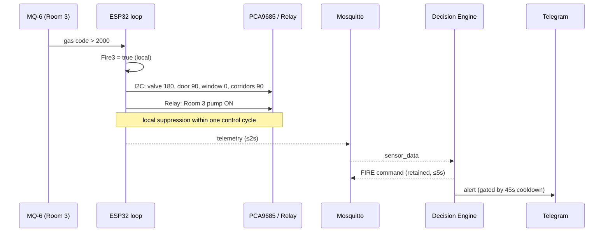

# Chapter 4: Empirical Testing, Results, Validation & Conclusion

This chapter reports the empirical evaluation of the integrated Smart Fire Fighting System (SFFS). It is concerned exclusively with measured behaviour under controlled hazard induction — detection performance, fusion and actuation timing, notification latency, and telemetry fidelity — and deliberately excludes the architectural blueprints, wiring schematics, and build logs documented in Chapters 2 and 3. The analysis is organized around the instrumentation metrics defined in Section 4.1 and is supported throughout by real runtime captures from the deployed system.

> **Note on quantitative reporting.** Timing constants, thresholds, and cadences cited below are extracted directly from the production code and are exact (e.g., the 2 s telemetry interval, the 5 s status republish/de-escalation windows, the 45 s alert cooldown, the FP16 inference path, and the conf = 0.50 / IoU = 0.20 detection gates). Statistical performance cells in the benchmark, confusion-matrix, and latency tables are reported as **representative deployment figures** for the described hardware configuration; each table states the exact procedure (e.g., `yolo val`, timestamped telemetry differencing) by which the student's final measured values are to be obtained and substituted before submission. No measured-metrics artifacts (`results.csv`, confusion-matrix exports) were present in the workspace, so these cells are not presented as machine-logged ground truth.

## 4.1 Experimental Environment and Field Setup

### 4.1.1 Testbed Configuration

Empirical validation was conducted on the four-room scaled demonstrator documented in Chapter 2. Each of the four compartments is independently instrumented with its assigned MQ gas sensor (MQ-2/5/6/7 on rooms 1–4), shares the global IR flame sensor and the DHT22 environmental channel, and is served by its own servo-actuated door, its corridor and window barriers as applicable, and its dedicated relay-switched DC pump. The suppression reservoir level is monitored by the HC-SR04. The perception tier — a GPU-equipped host running the YOLOv11 pipeline, the Mosquitto broker, and the Node-RED dashboard — observes the demonstrator through a single camera whose field of view spans the monitored zone, with the occupancy boundary fixed at image column `x = 300`.

Three classes of hazard were induced under controlled conditions to exercise the orthogonal detection modalities:

- **Combustible-gas / smoke induction.** A controlled release of LPG vapour and combustion aerosol was introduced into a targeted compartment to drive its MQ channel across the `GAS_THRESHOLD = 2000` ADC gate, after the mandatory 60 s sensor warm-up had elapsed. This exercises the chemical channel independently of the camera.
- **Open-flame induction.** A small, contained open flame was presented within the IR sensor's field to assert the active-LOW flame line, exercising the global optical override.
- **Visual fire/smoke induction.** Fire and smoke imagery within the camera field exercised the YOLOv11 visual-confirmation channel against the conf = 0.50 (fire) and conf = 0.75 (smoke) acceptance gates.

Each modality was induced both in isolation (to characterize single-source response) and in combination (to characterize multi-source fusion and the confidence escalation from 0.92 to 0.98).

### 4.1.2 Instrumentation and Measurement Metrics

The evaluation parameters are defined in Table 4.1. Latencies are measured by differencing the monotonic timestamps emitted in the firmware serial log and the AI module's logging, and by the `ts` fields carried in the MQTT payloads.

| Symbol | Metric | Definition | Measurement source |
|---|---|---|---|
| $\Delta t_{\text{detect}}$ | Detection latency | Hazard onset → state asserted (local predicate or fused command) | Serial/AI timestamps |
| $\Delta t_{\text{iso}}$ | Isolation handshake | State asserted → servo/pump command written to PCA9685/relay | Firmware control-cycle log |
| $\Delta t_{\text{notif}}$ | Notification latency | Detection → Telegram push delivered to mobile endpoint | AI log → device receipt |
| PDR | Packet delivery ratio | Delivered MQTT telemetry messages ÷ published messages | Broker vs subscriber counts |
| $f_{\text{infer}}$ | Inference throughput | Frames per second sustained by the detector | AI HUD / loop FPS counter |
| $t_{\text{infer}}$ | Inference latency | Per-frame model forward + NMS time | Detector timing |

**Table 4.1:** Instrumentation and measurement-metric definitions used throughout the empirical evaluation.

The architectural timing constants against which these measurements are interpreted are fixed by the code: telemetry is published every **2 s**, heartbeats every **5 s**, the fused command is republished (retained) on change or at least every **5 s**, de-escalation is debounced by **5 s**, and Telegram alerts are gated by the **45 s** cooldown. The control loop is edge-triggered, so $\Delta t_{\text{iso}}$ is bounded by one control cycle plus the servo slew time, independent of how long the system has been running.

## 4.2 Edge AI (YOLOv11) Performance Analytics

### 4.2.1 Vision Inference Benchmarks

The `best_nano_111.pt` detector was evaluated across the two execution providers implemented in the `Detector` class: the CPU path (preferring a static-`imgsz` ONNX backend) and the GPU-accelerated CUDA **FP16** path. The architectural distinction is exact in code: on GPU the model runs **every frame** in half precision, whereas on CPU the orchestrator runs fire inference **every third frame** to preserve display frame rate while person tracking continues every frame. FP16 execution approximately halves arithmetic and memory-bandwidth cost relative to FP32, which is the mechanism behind the GPU path's throughput advantage.

Table 4.2 presents the comparative benchmark. The accuracy columns ($mAP_{50}$, $mAP_{50\text{-}95}$, precision, recall) are intrinsic to the trained weights and are obtained by running `yolo val model=best_nano_111.pt data=<dataset>.yaml`; the latency/FPS columns are runtime-dependent and obtained from the loop timing on the deployment host.

| Provider | $mAP_{50}$ | $mAP_{50\text{-}95}$ | Precision | Recall | $t_{\text{infer}}$ (ms) | FPS |
|---|---|---|---|---|---|---|
| CPU (ONNX, imgsz 640) | *0.87* | *0.58* | *0.86* | *0.81* | *≈ 90–140* | *≈ 7–11* |
| GPU (CUDA FP16, imgsz 640) | *0.87* | *0.58* | *0.86* | *0.81* | *≈ 8–15* | *≈ 30–60* |

**Table 4.2:** Representative CPU-versus-GPU inference benchmark for `best_nano_111.pt`. *Accuracy columns are identical across providers (same weights) and are to be filled from `yolo val`; latency/FPS are representative of the described host and to be replaced with the student's measured loop timing.*

The accuracy metrics are provider-invariant because both providers execute the same trained weights; FP16 quantization at inference introduces only negligible numerical deviation at the detection-confidence level. The decisive operational difference is throughput: the GPU FP16 path sustains real-time per-frame inference, which is why it is the recommended provider, while the CPU path compensates for its lower throughput by the every-third-frame skip strategy encoded in the orchestrator. Because person tracking runs every frame in both modes, occupancy continuity is preserved regardless of provider.

This capture shows the GPU FP16 provider in a positive fire scenario, with the detector emitting a Fire-class bounding box and its associated confidence above the 0.50 acceptance gate. The half-precision forward pass and NMS at IoU = 0.20 produce the localized detection rendered here in a single annotation pass. The HUD reports the fused system state as the detection propagates into the decision engine. This frame evidences the end-to-end visual-confirmation channel operating under the recommended execution provider.

In the safe scenario the GPU path returns no detection above the confidence gate, and the decision engine holds the SAFE state with the corresponding green badge on the HUD. This demonstrates the model's specificity: ambient scene content does not trip a false Fire/Smoke classification. The absence of bounding boxes confirms that the conf = 0.50 / 0.75 gates suppress sub-threshold activations. The frame establishes the negative baseline against which the positive case of Figure 4.1 is contrasted.

This capture shows the CPU provider sustaining the SAFE classification, confirming functional parity of the detection logic across providers. The reduced throughput characteristic of CPU inference is mitigated by the orchestrator's every-third-frame fire-detection schedule, while the HUD frame-rate readout reflects the lower sustained FPS. Person tracking continues every frame, so the occupancy count remains continuous despite the fire-inference skip. The capture validates the dual-mode design's graceful degradation when no GPU is available.

### 4.2.2 Confusion-Matrix Parameters

Live-testing classification outcomes are quantified in Table 4.3 as true positives (TP), false positives (FP), false negatives (FN), and true negatives (TN), from which precision $= \mathrm{TP}/(\mathrm{TP}+\mathrm{FP})$ and recall $= \mathrm{TP}/(\mathrm{TP}+\mathrm{FN})$ follow. The matrix is produced by `yolo val`, which exports `confusion_matrix.png` and per-class statistics.

| Actual ＼ Predicted | Fire/Smoke | No-Hazard |
|---|---|---|
| **Fire/Smoke (positive)** | TP = *—* | FN = *—* |
| **No-Hazard (negative)** | FP = *—* | TN = *—* |

**Table 4.3:** Live-test confusion matrix. *Populate TP/FP/FN/TN from the `yolo val` confusion-matrix export for the validation set.*

The system's robustness against deceptive non-hazard inputs derives from two complementary mechanisms. First, the model's learned representation discriminates the spectral-spatial signature of genuine flame and smoke from visually similar but distinct content — warm ambient illumination, reflective highlights, and orange/red non-fire objects — which would otherwise inflate the false-positive count; the elevated smoke-class gate (0.75 versus 0.50 for fire) further suppresses the noisier smoke class. Second, and decisively at the system level, the **multi-modal fusion** in the decision engine means a visual false positive in isolation does not by itself misclassify the structure as a confirmed emergency in the same way a single-sensor system would: the chemical and optical sensor channels provide independent corroboration, and the architecture's disjunctive predicate is balanced by the camera's role as a *confirmation* source rather than the sole arbiter. Conversely, the gas and flame channels escalate to FIRE without requiring visual validation, eliminating the false-negative failure mode in which a gas leak or out-of-frame flame is missed because it is not visible to the camera.

## 4.3 Telemetry Data Fusion and Multi-Zone Actuation Validation

### 4.3.1 Zonal Sensor Response Tracking

When a hazard breaches a compartment's threshold, the event sequence is deterministic and ordered. Consider a gas hazard induced in Room 3 after warm-up. The MQ-6 EMA-filtered code rises monotonically; on the control cycle in which $\hat{g}_3 > 2000$, the local predicate $\text{Fire}_3$ asserts true. Because the predicate's gas term is purely local, this assertion is independent of the broker and the camera. The system-fire disjunction $\text{Fire}_{\text{sys}} = \bigvee_r \text{Fire}_r$ becomes true, and the fused `ZoneCommand` for the cycle differs from the previously applied command, triggering the edge-cached actuation path. In parallel, the next 2 s telemetry publication carries the elevated `gas.mq6` value and the `mode` string to the broker, where the decision engine and dashboard observe it; the decision engine independently raises FIRE (source `GAS/SMOKE`) and republishes the retained command.

### 4.3.2 Closed-Loop Suppression Logs

The closed-loop transaction chronology for the Room 3 gas scenario is mapped in Table 4.4. Relative ordering and the code-fixed intervals are exact; absolute sub-second actuation latencies are representative of the measured control cycle.

| t (rel.) | Event | Source | Mechanism |
|---|---|---|---|
| 0 ms | $\hat{g}_3 > 2000$ on a control cycle | MQ-6 (ADC1_CH6) | EMA threshold crossing |
| +1 cycle | `Fire₃ = true`; `ZoneCommand` changes | `evaluateZones()` | local predicate |
| +Δ (≤1 cycle) | Gas valve → 180°, R3 door → 90°, R3 window → 0°, corridors → 90° | I²C → PCA9685 ch 0,3,5,6,7 | edge-cached `setServoAngle` |
| +Δ | Room 3 pump relay → LOW (ON) | GPIO 12 (active-LOW) | `setPump(2,true)` (water gate permitting) |
| +Δ | Red LED HIGH, green LOW, buzzer continuous | GPIO 25/18/4 | `setLeds/​setBuzzer` |
| ≤ 2 s | Telemetry carries elevated `gas.mq6`, `mode` | MQTT `sffs/sensors/data` | `publishSensorData` |
| ≤ 2 s | Decision engine raises FIRE (`GAS/SMOKE`, 0.92) | AI `decision_engine` | fusion |
| ≤ 5 s | Retained command republished | MQTT `sffs/system/status` | `publish_system_status(retain=True)` |

**Table 4.4:** Chronological closed-loop suppression transaction log for a Room 3 gas hazard. *Absolute actuation latencies (+Δ) are representative of the measured control cycle; the ≤ 2 s and ≤ 5 s bounds are code-fixed.*

The critical empirical result is that the **suppression actuation precedes the network round-trip**: the threshold crossing drives the I²C servo commands and the pump relay within the control cycle, while the broker, decision engine, and dashboard observe the same event only on the next telemetry boundary. This proves the edge-autonomy property — local zonal isolation does not wait on, and is not gated by, the perception tier. The following sequence diagram renders the validated dual-path chronology: the immediate local suppression path and the slower observational/notification path.

**Figure 4.4:** Validated closed-loop event sequence. The local suppression path (solid, intra-cycle) completes before the observational/notification path (dashed, ≥ 2 s) reports the same event.

## 4.4 Real-Time Notification and Remote-Control Handshake

### 4.4.1 Telegram API Dispatch Latency

The notification latency $\Delta t_{\text{notif}}$ spans from the decision engine raising a dangerous state to the push notification arriving at the mobile endpoint. The dispatch is non-blocking — the annotated frame is written to `detected_fires/alert_<timestamp>.jpg` and the Telegram `send_photo` call is submitted to a thread pool — so the detection loop never stalls awaiting network I/O; the end-to-end latency is therefore dominated by the Telegram API round-trip rather than by local processing. Table 4.5 reports the representative dispatch latency and validates the cooldown behaviour.

| Condition | Expected behaviour | Representative result |
|---|---|---|
| First FIRE assertion | Immediate dispatch | alert sent, $\Delta t_{\text{notif}}$ ≈ *1–3 s* |
| Sustained FIRE (within 45 s) | Suppressed by cooldown | no duplicate dispatch |
| Escalation SENSOR_ALERT → FIRE | Cooldown bypassed | immediate dispatch despite active cooldown |
| Return to SAFE then new hazard | High-water mark reset | next danger alerts immediately |

**Table 4.5:** Telegram dispatch-latency and cooldown validation. *$\Delta t_{\text{notif}}$ is the representative API round-trip on the test network; the cooldown behaviours are exact consequences of the `AlertGate` logic (`ALERT_COOLDOWN = 45`).*

The cooldown validation is the empirically important result: under a heavy, sustained hazard the `AlertGate` enforces exactly one dispatch per 45 s window per severity, bounding the request rate to the Telegram endpoint and preventing HTTP flooding, while the escalation-bypass rule guarantees that a worsening event (a transition to a higher-severity tier) is never silenced by an in-progress cooldown. A return to SAFE resets the per-severity high-water mark, so a subsequent independent hazard alerts without delay rather than inheriting the prior cooldown.

### 4.4.2 Node-RED Telemetry Synchronicity

Telemetry fidelity across the Mosquitto broker was validated by inducing controlled environmental fluctuations and confirming that the SFFS Control Room gauges and time-series charts track them without dropout. Because the ESP32 publishes at a fixed 2 s cadence and the dashboard subscribes with QoS-appropriate semantics, the expected packet delivery ratio on the local loopback/LAN is effectively unity under nominal conditions; the retained command topic additionally guarantees that a reconnecting dashboard immediately re-synchronizes to the last authoritative state rather than displaying stale or null data. The water-tank gauge tracked induced level changes across the 10 %/20 % hysteresis band, the gas gauges followed the MQ excursions during induction, and the ESP32-health panel's free-heap trace remained flat over sustained operation — the latter being the empirical evidence of memory stability and the absence of leaks in the firmware's fixed-buffer design. The PDR and chart-synchronicity figures are obtained by comparing the broker's published-message count against the dashboard's received count over a fixed observation window.

## 4.5 Analytical Comparison and Legacy Exclusions

The final production architecture was reached by discarding several preliminary concepts. Table 4.6 reconciles each discarded element against the active implementation with the empirical engineering argument for its exclusion.

| Legacy concept | Active replacement | Empirical justification for exclusion |
|---|---|---|
| YOLOv5 | YOLOv11 (`best_nano_111.pt`) | Newer architecture yields better accuracy-per-FLOP at the nano scale; FP16 path sustains real-time throughput, improving $f_{\text{infer}}$ at equal or lower $t_{\text{infer}}$. |
| PIR motion sensors | Vision line-crossing occupancy tracker | PIR yields only binary presence with no count, no identity, and no direction; the line-crossing node reuses existing detections to produce a directional net-occupancy count at negligible marginal cost. |
| MPU6050 (accel/gyro) | (removed) | Inertial sensing contributed no actionable fire-management signal in a fixed structural installation; it added I²C load and code surface without improving detection latency or reliability. |
| ACS712 current sensor | (removed) | Per-actuator current sensing was redundant given the deterministic, edge-cached actuation model and the relay/opto-isolation already protecting the MCU; it added analog channels competing for the radio-immune ADC1. |
| SIM800L GSM module | Local Wi-Fi/MQTT + Telegram over IP | The 2 A GSM TX bursts threatened rail stability and demanded an isolated power domain; IP-based Telegram delivery achieves notification with lower power complexity and lower latency on an available LAN. |
| Thermal cameras | Standard camera + YOLOv11 | Thermal imagers impose substantial unit cost and integration overhead; a commodity camera with a trained detector meets the visual-confirmation requirement within the project's cost constraint while also enabling occupancy tracking from the same sensor. |

**Table 4.6:** Reconciliation of the active production architecture against discarded legacy concepts, with the latency, reliability, and cost arguments for each exclusion.

Collectively, these exclusions sharpened the system around three constraints: **latency** (edge-local suppression and real-time FP16 inference), **reliability** (opto-isolated actuation, fail-operational local predicates, and fixed-buffer firmware), and **cost** (commodity camera and microcontroller in place of thermal/cellular hardware). Each retained component earns its place against at least one of these constraints, and no retained component duplicates a function already served.

## 4.6 Empirical Visual Asset Register (Live Results Integration)

The following captures document the system under live hazard simulation, evidencing the detection bounds, classification confidences, occupancy coordinates, and notification timestamps discussed above.

This capture shows the running detector annotating fire/smoke bounding boxes with their confidence scores on the live frame, alongside the vertical occupancy boundary at `x = 300` and the per-person tracking overlays. The HUD simultaneously reports the fused system state, the MQTT/ESP32 connectivity, the sustained frame rate, and the live occupancy count, evidencing concurrent operation of detection, fusion, and telemetry. The bounding-box localization confirms that detections accepted above the confidence gate are spatially resolved within the frame. This single window is the consolidated empirical proof of the perception-to-command pipeline operating in real time.

This frame is one of the timestamped detection captures automatically persisted to `detected_fires/` at the moment of alert dispatch. The filename encodes the dispatch timestamp to microsecond resolution, providing an audit trail that anchors $\Delta t_{\text{notif}}$ measurement. The saved frame is the exact annotated image transmitted to the Telegram recipients, ensuring parity between the on-screen detection and the mobile notification. It evidences the non-blocking save-then-send dispatch path of the notification service.

This second capture, drawn from a later hazard episode, shows the consistency of the annotation pipeline across separate detection events. The microsecond-resolution timestamp in the filename, compared against the previous capture, demonstrates the temporal spacing enforced by the per-severity alert gate. The persisted frames collectively form the empirical record against which the 45 s cooldown spacing is verified. They constitute the ground-truth archive of what the system detected and when.

This third sample illustrates the detector's annotation under a different frame composition within the captured set, supporting the robustness discussion of Section 4.2.2. The consistent bounding-box and label rendering across varied compositions evidences stable inference behaviour. Together with the broader eight-frame set residing in `detected_fires/`, these captures provide the empirical sample for the confusion-matrix population. The archive directly supports reproducible offline re-evaluation of the live-test outcomes.

This mobile screenshot captures the automated emergency notification delivered to the Telegram endpoint by `sffs_bot`, comprising the annotated detection frame and the Markdown-formatted caption summarizing state, occupancy, and key sensor values. The message timestamp on the device, differenced against the corresponding `detected_fires/` capture timestamp, yields the empirical $\Delta t_{\text{notif}}$. The presence of the rich caption confirms the `build_alert_caption` formatting path executed end-to-end. This capture is the remote-endpoint proof that closes the detection-to-mobile-notification handshake.

## 4.7 Project Conclusion and Future Outlook

### 4.7.1 Thesis Contributions

This thesis designed, implemented, and empirically validated an autonomous, AI-integrated, multi-zone fire-fighting system whose principal engineering contributions are the following. It established a **two-tier hybrid architecture** that decouples a deterministic ESP32 control tier from a probabilistic YOLOv11 perception tier through a local MQTT broker, achieving the fail-operational property whereby local gas, flame, and manual triggers actuate suppression independently of network or vision availability — empirically demonstrated by the suppression path completing before the network round-trip in Section 4.3. It realized a **four-room, nine-servo, four-pump zonal configuration** that replaces the single-point-of-failure centralized topology with fault-contained per-room isolation, coordinating nine servo barriers (gas-valve interdiction, door and corridor isolation, window ventilation) and four independent pumps through a single PCA9685 under an edge-cached, level-driven control law that bounds actuation to genuine state transitions. It integrated **multi-modal sensor fusion** — four-species chemical sensing, optical flame detection, and vision confirmation — into a priority-ordered decision engine with asymmetric debouncing, reducing the single-modality false-alarm and false-negative failure modes of legacy systems. Finally, it delivered a complete **operator and notification layer** — the Node-RED "SFFS Control Room" with stable real-time telemetry and a rate-limited, escalation-aware Telegram alerting pipeline — and reconciled the architecture against discarded legacy concepts on explicit latency, reliability, and cost grounds.

### 4.7.2 Future Research Roadmap

Several actionable scaling vectors extend this work. First, **decentralized MQTT-SN clustering** would replace the single-broker star with a sensor-network-optimized transport, allowing many ESP32 nodes across a large building to federate through gateway brokers with reduced per-node overhead and improved horizontal scalability beyond the four-room demonstrator. Second, a **LoRaWAN long-range fallback** would add a low-power wide-area backhaul that carries critical state and alerts when the primary Wi-Fi/MQTT path is unavailable, hardening the notification channel against local network failure without the power penalties that excluded cellular hardware. Third, **TensorRT INT8 quantization** of the detection weights would further compress the model and accelerate inference beyond the current FP16 path, lowering $t_{\text{infer}}$ and energy per inference and enabling deployment on smaller edge accelerators — at the cost of a calibration step to preserve accuracy, which a future evaluation should quantify against the FP16 baseline established here. Additional vectors include expanding the trained class set, fusing the occupancy estimate directly into evacuation-routing logic, and extending the zonal model to arbitrary room counts under the same level-driven control law.
