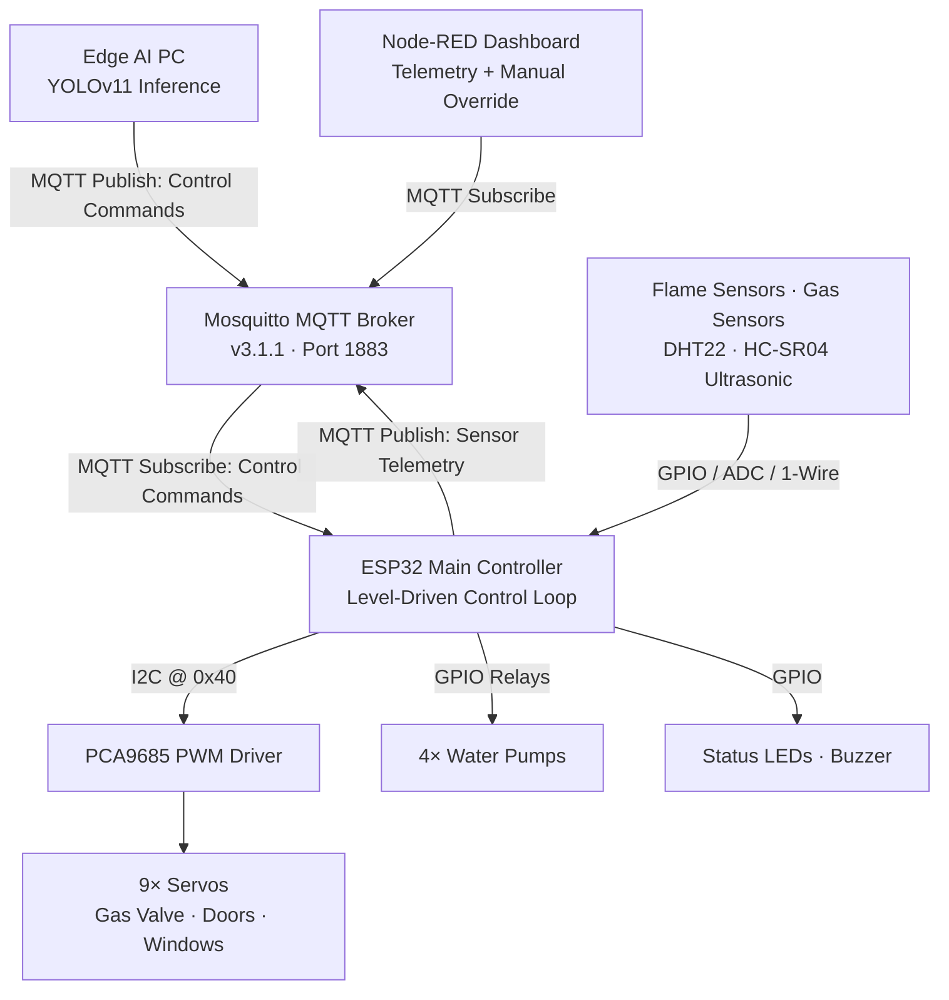

# Smart Fire Fighting System (SFFS) — Architecture & Technical Specification

**Document class:** Engineering reference manual
**Subject:** AI + IoT distributed fire detection and zonal suppression platform
**Firmware target:** Espressif ESP32-WROOM-32 (38-pin DevKit), Arduino framework
**AI target:** YOLOv11 edge inference (Python)
**Revision baseline:** 4-room / 9-servo / 4-pump production architecture

---

## 1. System Topology

The SFFS is a two-tier distributed control system. A vision/inference tier performs probabilistic fire and smoke detection; a real-time embedded tier performs deterministic, level-driven suppression. The two tiers are decoupled by an MQTT message bus, so the embedded controller remains fully autonomous if the inference tier or the network is lost.



**Interaction model.** The ESP32 publishes filtered sensor telemetry to `sffs/sensors/data` at 2 s intervals. The Python tier subscribes to that telemetry, runs YOLOv11 inference on the camera stream, fuses both evidence sources in `decision_engine.py`, and republishes a fused decision on `sffs/system/status` (retained, QoS 1). The ESP32 consumes only the `state` token from that command (the global FIRE override); all per-zone actuation is computed locally. The Mosquitto broker is the sole integration surface — neither tier holds a direct socket to the other. The Node-RED dashboard is a passive subscriber for visualization plus an active publisher for manual override injection.

**Autonomy guarantee.** Local sensors (MQ gas, IR flame, manual buttons) drive suppression directly inside the ESP32 loop and never depend on the broker. If WiFi or MQTT drops, the connectivity FSM transitions `NORMAL → DEGRADED` for telemetry purposes only; suppression continues uninterrupted.

---

## 2. Detailed Hardware Pin Map — ESP32 38-pin Utilization

All MQ analog sensors are placed on ADC1 because ADC2 is unusable for analog sampling while the WiFi radio is active. GPIO 6–11 are reserved for SPI flash and are never used. GPIO 34/35/36/39 are input-only.

| GPIO | Net / Function | Direction & Mode | Electrical Convention |
|------|----------------|------------------|------------------------|
| 32 | MQ-2 (Room 1, smoke) | Analog in (ADC1_CH4) | 0–4095 counts |
| 33 | MQ-5 (Room 2, LPG) | Analog in (ADC1_CH5) | 0–4095 counts |
| 34 | MQ-6 (Room 3, butane) | Analog in (ADC1_CH6, input-only) | 0–4095 counts |
| 35 | MQ-7 (Room 4, CO) | Analog in (ADC1_CH7, input-only) | 0–4095 counts |
| 27 | IR flame sensor | Digital in, `INPUT_PULLUP` | Active-LOW (LOW = flame) |
| 26 | DHT22 data | Digital I/O | 1-wire, internal pull-up on module |
| 21 | I2C SDA | I2C (hardware) | Dedicated to PCA9685 @ 0x40 |
| 22 | I2C SCL | I2C (hardware) | Dedicated to PCA9685 @ 0x40 |
| 15 | HC-SR04 TRIG | Digital out | 10 µs trigger pulse |
| 36 | HC-SR04 ECHO | Digital in (VP, input-only) | **Requires 5 V→3.3 V divider** |
| 16 | Button 1 (Room 1) | Digital in, `INPUT_PULLDOWN` | Active-HIGH (wire → 3.3 V) |
| 17 | Button 2 (Room 2) | Digital in, `INPUT_PULLDOWN` | Active-HIGH |
| 14 | Button 3 (Room 3) | Digital in, `INPUT_PULLDOWN` | Active-HIGH |
| 19 | Button 4 (Room 4) | Digital in, `INPUT_PULLDOWN` | Active-HIGH |
| 5 | Pump 1 relay (Room 1) | Digital out | Active-LOW (HIGH = OFF, LOW = ON) |
| 23 | Pump 2 relay (Room 2) | Digital out | Active-LOW |
| 12 | Pump 3 relay (Room 3) | Digital out | Active-LOW · **boot strapping pin** |
| 13 | Pump 4 relay (Room 4) | Digital out | Active-LOW |
| 18 | Green LED (SAFE) | Digital out | Active-HIGH |
| 25 | Red LED (FIRE) | Digital out | Active-HIGH |
| 4 | Active buzzer | Digital out | Continuous tone on DC HIGH |
| 2 | Boot LED (built-in) | Digital out | Boot indicator only |

Debounce: buttons are validated over a 300 ms window. Gas thresholds are gated by a 60 s MQ heater warm-up to suppress cold-start noise.

---

## 3. PCA9685 Servo Channel Map

The PCA9685 is driven over the dedicated I2C bus at address 0x40, configured for a 50 Hz servo refresh. Pulse width is mapped linearly from angle to a 12-bit count: **0° → 102 counts (~0.5 ms)** and **180° → 491 counts (~2.4 ms)**.

| Ch | Application | SAFE position | FIRE position | Trigger condition |
|----|-------------|---------------|---------------|--------------------|
| 0 | Gas main valve | 0° (OPEN) | 180° (CLOSED) | Any room in fire |
| 1 | Room 1 door | 0° (CLOSED) | 90° (OPEN) | Room 1 fire |
| 2 | Room 2 door | 0° (CLOSED) | 90° (OPEN) | Room 2 fire |
| 3 | Room 3 door | 0° (CLOSED) | 90° (OPEN) | Room 3 fire |
| 4 | Room 4 door | 0° (CLOSED) | 90° (OPEN) | Room 4 fire |
| 5 | Ground-floor corridor | 0° (CLOSED) | 90° (OPEN) | Any room in fire |
| 6 | First-floor corridor | 0° (CLOSED) | 90° (OPEN) | Any room in fire |
| 7 | Room 3 window | 90° (OPEN) | 0° (CLOSED) | Room 3 fire (oxygen starvation) |
| 8 | Room 4 window | 90° (OPEN) | 0° (CLOSED) | Room 4 fire (oxygen starvation) |

Calibration constants (`config.h`): `SERVO_PWM_FREQ = 50`, `SERVO_PWM_MIN = 102`, `SERVO_PWM_MAX = 491`. Doors and corridors share the closed-0°/open-90° convention; windows are inverted (safe-open/fire-closed) so the suppressed room is sealed against oxygen ingress while egress paths (doors, corridors) open.

---

## 4. Electrical Wiring Constraints

These three constraints are mandatory; violating any of them produces intermittent resets or boot failures that present as firmware bugs.

> [!WARNING]
> **GPIO 12 boot strapping (Pump 3).** GPIO 12 (MTDI) is sampled at reset to set the internal flash voltage. If the Pump 3 relay board holds this line HIGH during power-on, the chip selects 1.8 V flash and fails to boot. An external pull-down resistor (e.g., 10 kΩ to GND) must be fitted on the relay IN line so it reads LOW at reset. The firmware preloads the latch HIGH before switching the pin to OUTPUT to avoid a transient ON, but that does not cover the pre-firmware reset window — the external pull-down does.

> [!WARNING]
> **5 V / 5 A external V+ servo rail isolation.** The nine servos must be powered from an external 5 V rail connected to the PCA9685 V+ terminal, never from the ESP32 regulator. Simultaneous servo motion during a global-fire override produces a large transient draw; sharing it with the logic rail collapses the 3.3 V domain and resets the MCU. The V+ rail requires a bulk electrolytic capacitor (≥ 2200 µF) across V+/GND at the driver to absorb inrush. Logic VCC of the PCA9685 (3.3 V) and the servo V+ (5 V) are separate pins and separate domains; only grounds are common.

> [!WARNING]
> **HC-SR04 ECHO voltage divider.** The HC-SR04 ECHO pin outputs 5 V logic, but ESP32 GPIO is 3.3 V-tolerant only. A resistive divider (1 kΩ series, 2 kΩ to GND, giving ~3.3 V) must sit between ECHO and GPIO 36. TRIG (GPIO 15) is an output and needs no divider.

Common ground: all rails (ESP32, PCA9685 V+, pump supply, sensor 5 V) must share a single ground reference.

---

## 5. Software Architecture & Embedded Logic

### Level-Driven Real-Time Control Loop

The controller holds no software latches or suppression timers. Every loop iteration recomputes the complete desired output state from current inputs and synchronizes hardware to it.

> [!NOTE]
> This stateless design makes outputs a pure function of present sensor levels. It eliminates stuck-alarm failure modes and makes behavior trivially testable — no software latches or suppression timers are held across iterations.

### Zonal Evaluation Matrix

Each room's fire status is evaluated independently. The gas term is gated by the 60 s warm-up; buttons are not gated (immediate manual trigger).

```mermaid
flowchart LR
    B[Button[i] == HIGH] --> OR{OR}
    G{Gas[i] > GAS_THRESHOLD<br/>= 2000} --> W{Sensors<br/>Warmed Up?}
    W -- Yes --> OR
    W -- No --> OFF[roomFire[i] = false]
    OR -- True --> ON[roomFire[i] = true]
    OR -- False --> OFF
```

### Global Emergency Overrides

Two conditions force all four rooms into fire simultaneously, irrespective of their local sensors. The first is a local hardware path (no network dependency); the second is the fused AI verdict arriving over MQTT. Either instantly escalates the whole structure.

```mermaid
flowchart LR
    FL[Flame Detected<br/>GPIO27 == LOW] --> OR2{OR}
    MQ[MQTT state == "FIRE"] --> OR2
    OR2 --> GF[globalFire = true]
    GF --> ALL[roomFire[0..3] = true]
```

### Actuator Edge-Caching

The fused desired state is packed into a `ZoneCommand` struct (`anyFire`, `roomFire[4]`, `pumpOn[4]`). Each loop the new command is compared against the last applied command with `memcmp`; hardware writes occur **only on a difference**.

> [!NOTE]
> A second cache layer lives inside `ActuatorController`: each servo/pump/LED setter stores its last value and skips the I2C or GPIO write when unchanged. The combined effect is that an idle system issues zero bus traffic, eliminating PCA9685 chatter and servo jitter caused by redundant pulse rewrites.

```
ZoneCommand desired = evaluateZones();      // memset to zero first -> reliable memcmp
... derive pumpOn[] via water gate ...
if (!appliedInit || memcmp(&desired, &appliedCmd, sizeof(ZoneCommand)) != 0) {
    applyZoneCommand(desired);
    appliedCmd = desired;
}
```

### Water-Level Safety Hysteresis

Dry-run protection gates the pumps with a hysteresis band so a fluctuating reading near the threshold cannot rapidly cycle the relays.

```mermaid
flowchart TD
    L{Water Level} --> CHK{level < 10%?}
    CHK -- Yes --> CUT[pumpsAllowed = false]
    CUT --> CHK2{level >= 20%?}
    CHK -- No --> CHK2
    CHK2 -- Yes --> EN[pumpsAllowed = true]
    CHK2 -- No --> HOLD[Hold previous state]
    EN --> OUT[pumpOn[i] = roomFire[i] AND pumpsAllowed]
    CUT --> OUT
    HOLD --> OUT
```

### Connectivity FSM

A lightweight `NORMAL → DEGRADED → RECOVERY → NORMAL` state machine tracks WiFi+MQTT health and exposes a `mode` string for telemetry. It does not actuate hardware; suppression autonomy is already guaranteed by the local sensor paths.

---

## 6. MQTT Communication Contract

Broker: Mosquitto, MQTT v3.1.1, port 1883. The AI module connects on `localhost`; the ESP32 connects to the broker host's LAN IP (configured in `secrets.h`).

### `sffs/sensors/data` — ESP32 → AI

Published every 2 s, QoS 0.

```json
{
  "ts": 1234,
  "gas": {
    "mq2": 512,
    "mq5": 480,
    "mq6": 470,
    "mq7": 505
  },
  "env": {
    "temp": 24.6,
    "hum": 41.2
  },
  "water": {
    "level_pct": 78.5,
    "distance_cm": 4.3
  },
  "manual_trigger": 0,
  "meta": {
    "wifi_rssi": -58,
    "uptime_s": 3601,
    "heap_free": 201340,
    "mode": "NORMAL",
    "flame": false
  }
}
```

| Key | Type | Unit | Description |
|-----|------|------|-------------|
| `ts` | `uint32` | Unix epoch s | Timestamp of the publication |
| `gas.mq2` | `uint16` | ADC counts | MQ-2 smoke sensor (Room 1) |
| `gas.mq5` | `uint16` | ADC counts | MQ-5 LPG sensor (Room 2) |
| `gas.mq6` | `uint16` | ADC counts | MQ-6 butane sensor (Room 3) |
| `gas.mq7` | `uint16` | ADC counts | MQ-7 CO sensor (Room 4) |
| `env.temp` | `float` | °C | DHT22 ambient temperature |
| `env.hum` | `float` | % RH | DHT22 relative humidity |
| `water.level_pct` | `float` | % | Reservoir fill level |
| `water.distance_cm` | `float` | cm | HC-SR04 distance to water surface |
| `manual_trigger` | `uint8` | boolean | 1 if any manual button is pressed |
| `meta.wifi_rssi` | `int8` | dBm | WiFi signal strength |
| `meta.uptime_s` | `uint32` | s | ESP32 uptime since boot |
| `meta.heap_free` | `uint32` | bytes | Free heap memory |
| `meta.mode` | `string` | — | Connectivity FSM state |
| `meta.flame` | `boolean` | — | IR flame sensor state |

### `sffs/system/status` — AI → ESP32

Retained, QoS 1.

```json
{
  "ts": 1234,
  "state": "FIRE",
  "confidence": 0.98,
  "source": "GAS/SMOKE+FLAME",
  "actions": {
    "gas_valve": "CLOSE",
    "doors": "OPEN",
    "pump1": "ON",
    "pump2": "ON"
  }
}
```

The ESP32 parses `state` (global FIRE override) and `confidence`; the `actions` block is informational, because per-zone actuation is computed locally.

| Key | Type | Unit | Description |
|-----|------|------|-------------|
| `ts` | `uint32` | Unix epoch s | Timestamp of the publication |
| `state` | `string` | — | `"FIRE"` or `"SAFE"` — global override level |
| `confidence` | `float` | 0.0–1.0 | YOLOv11 inference confidence score |
| `source` | `string` | — | Evidence source label (e.g., `"GAS/SMOKE+FLAME"`) |
| `actions.gas_valve` | `string` | — | `"CLOSE"` / `"OPEN"` |
| `actions.doors` | `string` | — | `"OPEN"` / `"CLOSE"` |
| `actions.pumpN` | `string` | — | `"ON"` / `"OFF"` per pump |

### `sffs/system/heartbeat` — ESP32 → AI

Published every 5 s. Last-Will-and-Testament is a retained `{"status":"offline"}` registered at connect.

```json
{
  "ts": 1234,
  "status": "alive"
}
```

### `sffs/manual/alarm` — ESP32 → Dashboard (Auxiliary)

Carries per-room button edges for the dashboard; not consumed by the AI.

```json
{
  "ts": 1234,
  "room": 2,
  "active": true
}
```

| Key | Type | Unit | Description |
|-----|------|------|-------------|
| `ts` | `uint32` | Unix epoch s | Timestamp of the button edge |
| `room` | `uint8` | room index | Room number (1–4) |
| `active` | `boolean` | — | Button press (true) or release (false) |

---

## 7. Node-RED Telemetry Flow

The dashboard subscribes to `sffs/sensors/data`, parses the JSON, and routes fields to widgets.

### Connectivity & Health Row

WiFi RSSI gauge fed by `meta.wifi_rssi` (dBm, typical −50 strong to −85 weak); free-heap chart from `meta.heap_free` (bytes) used to confirm memory stability over long runs (a flat line indicates no leak); uptime readout from `meta.uptime_s` rendered as d/h/m.

### Per-Room Fire Matrix

Four indicators driven by the gas fields and the inferred room state, with the `meta.flame` boolean as a global banner.

### Water Reservoir Gauge

`water.level_pct` with threshold markers at 10 % (cutoff) and 20 % (re-enable).

### Environment Charts

`env.temp` and `env.hum` line charts.

### Manual Override

Dashboard switch nodes publish a command to `sffs/system/status` (or a dedicated manual topic) shaped as the command schema, e.g. `{"state":"FIRE","source":"DASHBOARD","confidence":1.0}`, allowing an operator to force or clear the global emergency. The retained-message semantics mean a newly connected ESP32 immediately receives the last operator state.

Import path: `iot/nodered_dashboard_flow.json`.