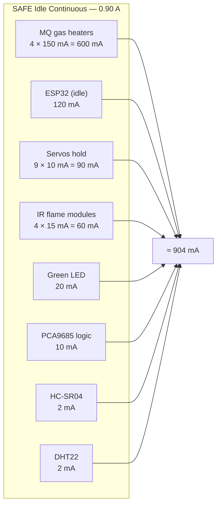
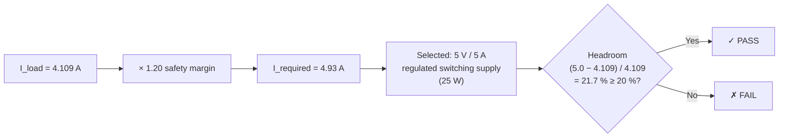
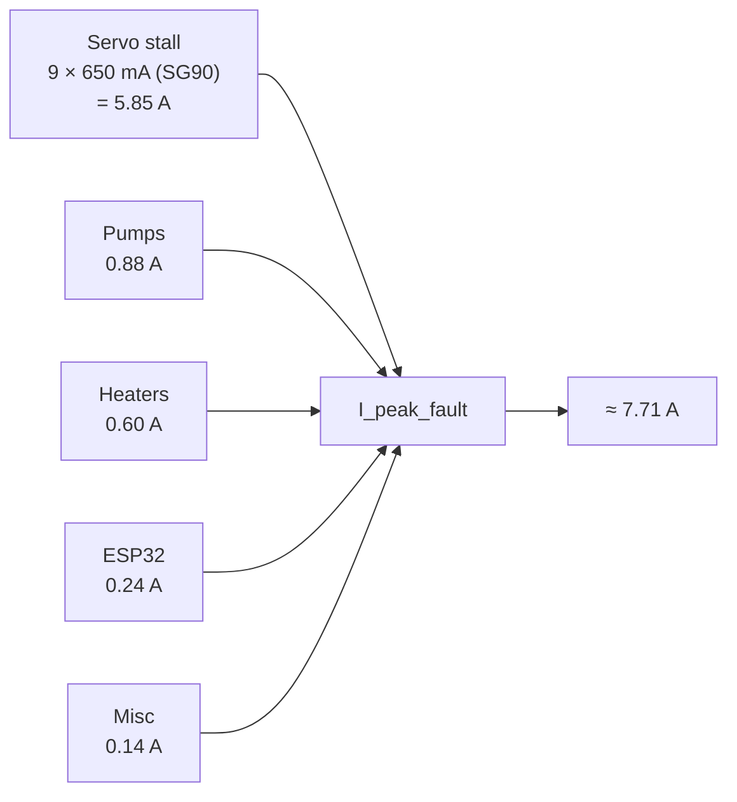

# SFFS — Updated Electrical Power Budget (4-Room / 9-Servo / 4-Pump Architecture)

**Scope:** Quantitative supply sizing for the current production hardware.
**Method:** Baseline per-component currents are taken from the original `power_budget.md` (single-unit measured/datasheet figures) and scaled to the live channel count. All currents are referred to the 5 V system bus unless noted.

---

## 1. Baseline Component Metrics (parsed from original budget)

| Component | Typical | Peak | Source convention |
|-----------|---------|------|-------------------|
| ESP32-WROOM-32 | 80 mA | 240 mA (WiFi TX) | 3.3 V via on-board AMS1117 (fed from 5 V) |
| MQ gas sensor (heater) | 150 mA | 160 mA | 5 V, continuous (~33 Ω coil) |
| PCA9685 (logic) | 10 mA | 10 mA | 3.3 V logic VCC |
| DHT22 | 1.5 mA | 2.5 mA | 3.3 V |
| IR flame module | 15 mA | 20 mA | 5 V comparator |
| Servo (SG90/MG995 class) | 10 mA idle | 250 mA nominal slew | 5 V V+ |
| Active buzzer | 25 mA | 30 mA | 5 V, alarm only |
| HC-SR04 | 2 mA | 15 mA | 5 V, pulse |
| Status LED | — | 20 mA | one active at a time |
| Relay coil | 75 mA | — | per channel, when energized |

Servo stall (mechanical jam / startup inrush): SG90 ≈ 650 mA, MG995 ≈ 900–1200 mA per unit. Stall is treated as a transient fault condition, not a continuous operating point (see §4).

---

## 2. Logic Rail — 3.3 V Domain (on-board regulated)

This domain is supplied by the ESP32's AMS1117 regulator, which itself draws from the 5 V bus. Its current is therefore already accounted for inside the ESP32's 5 V figure; it is itemized here for completeness.

| Load | Qty | Per-unit | Subtotal (typ) |
|------|-----|----------|----------------|
| ESP32 core + WiFi | 1 | 80 mA (240 mA TX) | 80 mA |
| PCA9685 logic VCC | 1 | 10 mA | 10 mA |
| DHT22 | 1 | 1.5 mA | 1.5 mA |
| Manual buttons (pull-down leakage) | 4 | ~0.25 mA | 1 mA |
| **3.3 V logic subtotal** | | | **≈ 92.5 mA** |

The four IR flame modules are 5 V-powered comparators with 3.3 V-safe digital outputs; their supply current is booked on the 5 V rail (§3), and their GPIO interface load on the logic rail is negligible.

---

## 3. Actuator / Sensor Rail — 5 V External Domain

This is the rail that the main supply must size for. The table below is the **worst-case concurrent FIRE-onset condition**: a global override fires, so all nine servos slew simultaneously, all four pumps run, all gas heaters are hot, and the radio is transmitting.

| Load | Qty | Per-unit | Subtotal |
|------|-----|----------|----------|
| Servos — nominal simultaneous slew | 9 | 250 mA | 2250 mA |
| Water pumps — under hydraulic load | 4 | 220 mA | 880 mA |
| MQ gas heaters — continuous | 4 | 150 mA | 600 mA |
| ESP32 (5 V input, WiFi TX peak) | 1 | 240 mA | 240 mA |
| IR flame modules | 4 | 15 mA | 60 mA |
| Active buzzer (alarm) | 1 | 30 mA | 30 mA |
| Status LED (red, FIRE) | 1 | 20 mA | 20 mA |
| HC-SR04 (measurement pulse) | 1 | 15 mA | 15 mA |
| PCA9685 logic | 1 | 10 mA | 10 mA |
| DHT22 | 1 | 3 mA | 3 mA |
| Manual buttons | 4 | 0.25 mA | 1 mA |
| **5 V worst-case operational total** | | | **≈ 4109 mA (4.11 A)** |

For reference, the **SAFE (idle) continuous** load — servos holding at rest, pumps off, buzzer off, green LED on — is dominated by the always-on gas heaters:

---

## 4. Mathematical Validation — 5 V / 5 A Supply Selection

### Worst-Case Operational Load

A 5 V / 5 A supply satisfies the worst-case concurrent operational draw with the required ≥ 20 % margin. A 3 A supply (the original two-servo design point) is rejected: at 4.11 A operational it would be in 137 % overload.

### Transient / Stall Ceiling

The absolute fault ceiling — all nine servos stalling at once — is bounded but exceeds the supply:

> [!WARNING]
> **9-servo stall current ceiling.** The absolute fault ceiling of ~7.71 A exceeds the 5 A supply rating. This condition is not a steady-state design point and is mitigated structurally rather than by oversizing the supply. A higher-rated supply (e.g., 5 V / 8 A) would remove the dependence on bulk capacitance for stall inrush and is the recommended upgrade if MG995-class metal-gear servos replace the SG90-class units.

> [!NOTE]
> **Bulk capacitor inrush mitigation.** A bulk electrolytic capacitor (≥ 2200 µF) across the V+ rail at the PCA9685 sources the inrush, holding rail voltage above the brown-out threshold. The edge-cached control law issues a servo write only on a state change, so the worst case occurs at most once per fire transition, never repetitively. Mechanical design prevents a continuously stalled servo (no actuator is driven against a hard stop at its commanded endpoint).

> [!WARNING]
> **MG995 upgrade consideration.** Under MG995-class metal-gear servos (900–1200 mA stall per unit), the fault ceiling rises to ≈ 11–12 A. Capacitor sizing must be re-evaluated if upgrading from SG90-class units.

### Mitigation Architecture

The stall condition is addressed through four structural mechanisms:

1. **Transient duration.** Servos reach commanded position in < 0.5 s, so simultaneous draw is a sub-second inrush, not a sustained load.

2. **Bulk capacitance.** A bulk electrolytic capacitor (≥ 2200 µF) across the V+ rail at the PCA9685 sources the inrush, holding rail voltage above the brown-out threshold.

3. **Edge-cached control law.** The control law issues a servo write only on a state change, so the worst case occurs at most once per fire transition, never repetitively.

4. **Mechanical design.** No actuator is driven against a hard stop at its commanded endpoint, preventing a continuously stalled servo.

---

## 5. Summary

| Operating state | 5 V bus current | Supply utilization (5 A) |
|-----------------|-----------------|--------------------------|
| SAFE (continuous) | 0.90 A | 18 % |
| FIRE operational (worst case) | 4.11 A | 82 % |
| + 20 % margin | 4.93 A | 99 % |
| Stall fault (transient, capacitor-buffered) | ~7.7 A | exceeds — buffered, < 0.5 s |

The 5 V / 5 A rail is validated for all continuous and operational states with ≥ 20 % margin. Pumps switched through relays and any motor supply above 5 V must be carried on their own matched rail with a common ground, exactly as in the baseline design.