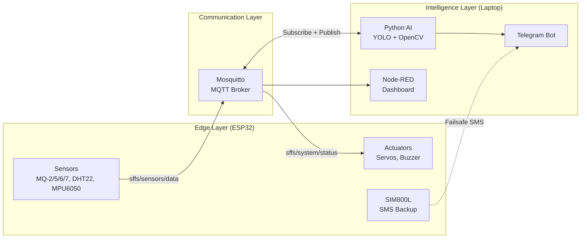

# 🔥 SFFS — Architectural Review & Engineering Feedback

## 1. Overall Architecture Assessment

**Verdict: Strong foundation with a few critical areas to tighten.**

Your three-tier architecture (ESP32 → MQTT Broker → AI/Dashboard) is a sound pattern for IoT systems. The key design decision of **"Visual Verification before alarm escalation"** is genuinely excellent — it addresses the #1 problem in fire detection: **false positives**. This alone elevates the project above a typical sensor-threshold system.



> [!TIP]
> The architecture naturally separates concerns: the ESP32 handles real-time I/O, the laptop handles heavy inference, and MQTT decouples them cleanly. This is textbook good design.

---

## 2. Safety-Critical Design Review

### 2.1 Visual Verification Pipeline — Potential Race Condition

Your current flow is:

```
Sensor Threshold Breached → Publish to MQTT → AI Sees It → AI Runs YOLO → AI Confirms/Denies → Publishes Status → ESP32 Acts
```

> [!WARNING]
> **Latency Risk:** This round-trip (ESP32 → Broker → AI inference → Broker → ESP32) can take 2–5 seconds under ideal conditions, but could spike to 10–15s if the YOLO model is under load or the network hiccups. For a **gas leak near an ignition source**, this delay could be catastrophic.

**Recommendation — Dual-Mode Response:**

| Threat Level | Sensor Condition | AI Required? | ESP32 Action |
|---|---|---|---|
| **ALERT** | Single sensor marginally above threshold | Yes — wait for AI | Buzzer LOW, publish alert, wait |
| **CRITICAL** | Multiple sensors OR sustained high readings (e.g., >30s) | No — act immediately | Gas valve SHUT, Buzzer HIGH, notify AI post-facto |
| **CONFIRMED FIRE** | AI visually confirms flame/smoke | Already confirmed | Full response: doors open, SMS sent, Telegram alert |

This gives you **defense-in-depth**: the AI improves accuracy, but the ESP32 never waits for AI when life is at risk.

### 2.2 Failsafe Mode — Strengthening the Design

Your standalone mode concept is correct. Here's how to make it production-grade:

```
┌─────────────────────────────────────────────────┐
│           ESP32 Failsafe State Machine          │
├─────────────────────────────────────────────────┤
│                                                 │
│  NORMAL ──(WiFi lost)──► DEGRADED               │
│    │                        │                   │
│    │                   (Sensor critical          │
│    │                    for >30s)                │
│    │                        │                   │
│    │                        ▼                   │
│    │                   STANDALONE_ALERT          │
│    │                    • Gas valve shut         │
│    │                    • Buzzer ON              │
│    │                    • SMS via SIM800L        │
│    │                        │                   │
│    │                   (WiFi restored)           │
│    │                        │                   │
│    └──────────────◄─────────┘                   │
│            RECOVERY                             │
│         • Sync missed events                    │
│         • Resume normal ops                     │
│                                                 │
└─────────────────────────────────────────────────┘
```

> [!IMPORTANT]
> **Key addition:** When transitioning from `STANDALONE_ALERT` back to `NORMAL`, the ESP32 should publish a **"missed events" buffer** — a log of what happened while disconnected. This gives the dashboard and AI a complete audit trail.

### 2.3 Servo as Gas Valve — Safety Caveat

> [!CAUTION]
> An SG90 servo controlling a gas valve is acceptable for a **prototype/demo**. In a real deployment, you'd need a solenoid gas valve (normally closed, fail-safe) with a relay. For your graduation project, **clearly document this as a simulation** and ensure your evaluators understand the SG90 represents a solenoid in the final design. This shows engineering maturity.

---

## 3. Hardware & Power Architecture Review

### 3.1 Power Budget Analysis

Your choice of a 5V / 3–5A external adapter is correct. Here's the detailed budget:

| Component | Typical Current | Peak Current | Notes |
|---|---|---|---|
| ESP32 (WiFi active) | 80–160 mA | 240 mA | TX bursts |
| MQ-2 (heater) | ~150 mA | ~180 mA | Internal 5V heater |
| MQ-5 (heater) | ~150 mA | ~180 mA | Internal 5V heater |
| MQ-6 (heater) | ~150 mA | ~180 mA | Internal 5V heater |
| MQ-7 (heater) | ~150 mA | ~180 mA | Cycled 5V/1.4V |
| DHT22 | ~1.5 mA | ~2.5 mA | Negligible |
| MPU6050 | ~3.5 mA | ~5 mA | Negligible |
| SG90 Servo × 2 | ~200 mA each | ~700 mA each | Under load, stall |
| SIM800L | ~50 mA idle | **2000 mA** | TX burst (2A spike!) |
| Buzzer (active) | ~25 mA | ~40 mA | Depends on type |
| **TOTAL** | **~1.12 A** | **~3.9 A** | Excluding SIM800L peak |

> [!WARNING]
> **SIM800L is your biggest power risk.** Its 2A TX spikes can brown-out the entire system if shared on the same rail. You **must** add:
> - A **470µF–1000µF electrolytic capacitor** directly across the SIM800L VCC/GND pins
> - Ideally a separate **3.7V LiPo battery** or a dedicated buck converter for the SIM800L
> - The SIM800L operates at **3.4V–4.4V** (NOT 5V!) — you need a voltage step-down

### 3.2 Recommended Power Topology

```
External 5V / 5A Adapter
        │
        ├──► [5V Rail] ──► MQ Sensor Heaters (×4)
        │                  SG90 Servos (×2)
        │                  Active Buzzer
        │
        ├──► [3.3V LDO / ESP32 onboard regulator]
        │         └──► ESP32 Logic
        │              DHT22 (can run at 3.3V)
        │              MPU6050 (3.3V)
        │
        └──► [Buck Converter 5V→4.1V or LiPo]
                  └──► SIM800L + 1000µF cap

        ════════════════════════════════════
             COMMON GROUND (all rails)
```

> [!IMPORTANT]
> **Never power servos from the ESP32's 3.3V pin.** They must be on the 5V rail with only their signal wire going to an ESP32 GPIO. Similarly, the MQ sensor heaters draw from 5V, but their analog output goes to the ESP32 ADC (which is 3.3V tolerant — the MQ analog out is typically 0–1V range, so this is safe).

---

## 4. MQTT Architecture Design

### 4.1 Topic Hierarchy

```
sffs/
├── sensors/
│   └── data              # ESP32 → Broker (periodic sensor telemetry)
├── system/
│   ├── status            # AI → Broker → ESP32 (system state commands)
│   ├── heartbeat         # ESP32 → Broker (alive/connectivity check)
│   └── config            # Dashboard → ESP32 (runtime config changes)
├── ai/
│   ├── detection         # AI → Broker (raw detection results)
│   └── people_count      # AI → Broker (occupant tracking data)
└── alerts/
    └── telegram          # AI → Broker (alert log for dashboard display)
```

### 4.2 JSON Payload Schemas

**`sffs/sensors/data`** — Published by ESP32 every ~2 seconds:
```json
{
  "ts": 1716478800,
  "gas": {
    "mq2": 342,
    "mq5": 128,
    "mq6": 215,
    "mq7": 89
  },
  "env": {
    "temp": 28.5,
    "hum": 62.3
  },
  "motion": {
    "ax": 0.02,
    "ay": -0.01,
    "az": 9.78,
    "tilt": false
  },
  "meta": {
    "wifi_rssi": -45,
    "uptime_s": 3600,
    "heap_free": 120000,
    "mode": "NORMAL"
  }
}
```

**`sffs/system/status`** — Published by AI, subscribed by ESP32:
```json
{
  "ts": 1716478802,
  "state": "FIRE",
  "confidence": 0.92,
  "source": "AI_VISUAL",
  "actions": {
    "gas_valve": "CLOSE",
    "doors": "OPEN",
    "buzzer": "ON"
  }
}
```

> [!TIP]
> Including `wifi_rssi`, `uptime_s`, and `heap_free` in the sensor payload gives the dashboard real-time health monitoring of the ESP32 itself — very useful for debugging and demo day.

### 4.3 Heartbeat & Connectivity Detection

The ESP32 should publish to `sffs/system/heartbeat` every **5 seconds** with a simple:
```json
{ "ts": 1716478800, "status": "alive" }
```

The AI script should monitor this topic. If no heartbeat is received for **15 seconds**, the AI should:
1. Log the disconnection event
2. Flag the dashboard (via Node-RED)
3. Optionally send a Telegram alert: "⚠️ ESP32 connectivity lost"

---

## 5. Sensor Filtering Strategy

### 5.1 Moving Average — Good Start, Consider Exponential

A **Simple Moving Average (SMA)** with a window of 10–20 readings is fine for demo purposes. However, for better responsiveness to actual gas events, consider an **Exponential Moving Average (EMA)**:

```
EMA formula:
  filtered = α × raw + (1 − α) × previous_filtered
  
Where α (alpha) = 0.1 to 0.3
  - Lower α = smoother but slower response
  - Higher α = faster response but more noise
```

**Why EMA over SMA?**
- SMA treats all 20 readings equally — a sudden real gas spike gets diluted
- EMA weights recent readings more heavily — responds faster to genuine events
- EMA uses O(1) memory (just one float) vs SMA needing a circular buffer

**My recommendation:** Use EMA with α = 0.2 as default. We can tune it during testing.

### 5.2 MQ Sensor Warm-up Handling

> [!IMPORTANT]
> MQ sensors require **24–48 hours of initial burn-in** for stable readings (per datasheets). For practical testing, they stabilize reasonably after **2–5 minutes** of power-on. Your code should:
> 1. Ignore all readings for the first 60 seconds after boot (warm-up period)
> 2. Flag sensor data as `"calibrating": true` during the first 3 minutes
> 3. Only trigger alerts after the warm-up flag clears

---

## 6. AI Module Feedback

### 6.1 YOLO Model Selection

For real-time detection on a laptop:
- **YOLOv8n (nano)** or **YOLOv11n** — Best balance of speed/accuracy for a laptop GPU or even CPU
- If you have a dedicated GPU: YOLOv8s (small) will give better accuracy
- For fire/smoke: You'll likely need a **custom-trained or fine-tuned model** since default COCO weights don't include fire/smoke classes

> [!NOTE]
> There are several open-source fire/smoke YOLO datasets on Roboflow and Kaggle. We can discuss which model weights to use when we reach Phase 2.

### 6.2 People Counting Architecture

For occupant tracking, I recommend a two-stage pipeline:

```
Webcam Frame
    │
    ▼
[YOLO Person Detection] ──► Bounding Boxes
    │
    ▼
[Tracker (e.g., ByteTrack / DeepSORT)] ──► Assign persistent IDs
    │
    ▼
[Counting Logic]
    ├── Define "entry zone" and "exit zone" in frame
    ├── Track centroid crossing direction
    └── Maintain: current_inside = entries - exits
    │
    ▼
[Publish to MQTT: sffs/ai/people_count]
```

Since you mentioned I can write the tracking logic from scratch if needed — **I recommend we use ByteTrack** (it's lightweight, doesn't need a separate ReID model like DeepSORT, and works well with YOLO). I can implement a clean version from scratch or adapt the open-source implementation.

### 6.3 Telegram Integration

Clean separation of concerns:
- **Text alerts:** State changes (`GAS_LEAK`, `FIRE`, `ALL_CLEAR`)
- **Image alerts:** Send annotated frame (with bounding boxes) on detection
- **People count:** Include in fire alerts: "🔥 FIRE DETECTED — 3 occupants still inside"
- **Rate limiting:** Don't spam — minimum 30-second interval between duplicate alerts

---

## 7. Node-RED Dashboard Suggestions

For maximum demo impact, your dashboard should include:

| Panel | Type | Data Source |
|---|---|---|
| Gas Levels | 4× live gauges | `sffs/sensors/data → gas.*` |
| Temperature | Gauge + line chart | `sffs/sensors/data → env.temp` |
| Humidity | Gauge | `sffs/sensors/data → env.hum` |
| System State | Large status indicator (color-coded) | `sffs/system/status → state` |
| People Inside | Numeric display | `sffs/ai/people_count` |
| ESP32 Health | RSSI + uptime + heap | `sffs/sensors/data → meta` |
| Event Log | Scrolling text feed | All alert topics |
| Camera Feed | Live MJPEG stream (optional) | Separate HTTP endpoint from Python |

---

## 8. Development Roadmap — Refined

### Phase 1: IoT Foundation (ESP32)
```
1.1  Hardware assembly & power rail validation
1.2  Individual sensor bring-up (test each MQ, DHT22, MPU6050)
1.3  Implement EMA filtering on analog sensors
1.4  JSON payload construction & Serial Monitor validation
1.5  WiFi + MQTT connection with reconnect logic
1.6  Subscribe to sffs/system/status, parse commands, drive actuators
1.7  Implement failsafe state machine (NORMAL → DEGRADED → STANDALONE_ALERT)
1.8  SIM800L SMS integration (test independently first)
1.9  Full ESP32 standalone test with simulated MQTT commands
```

### Phase 2: AI Pipeline (Python)
```
2.1  Webcam capture + YOLO fire/smoke detection (standalone test)
2.2  People detection + ByteTrack tracking + counting logic
2.3  MQTT client: subscribe to sffs/sensors/data, publish sffs/system/status
2.4  Decision engine: combine sensor data + visual detection → state output
2.5  Telegram Bot integration (text + image alerts)
2.6  Performance tuning (FPS, latency measurement)
```

### Phase 3: Integration & Hardening
```
3.1  End-to-end MQTT flow validation
3.2  Node-RED dashboard build
3.3  Failsafe scenario testing (kill WiFi, kill broker, kill AI)
3.4  Latency measurement & optimization
3.5  Demo preparation & documentation
```

---

## 9. Risks & Mitigations Summary

| Risk | Impact | Mitigation |
|---|---|---|
| SIM800L brownout crashes ESP32 | System offline during emergency | Separate power rail + bulk capacitor |
| AI inference too slow (>5s) | Delayed fire response | Nano model + failsafe timer on ESP32 |
| MQ sensor false positive (cooking, steam) | Nuisance alarms | Visual verification + EMA + multi-sensor correlation |
| WiFi drops during fire (heat/interference) | No AI verification | Standalone mode + SMS backup |
| YOLO misses fire (unusual angle, occlusion) | Missed real fire | Sensor-only CRITICAL override after sustained threshold |
| ESP32 ADC nonlinearity | Inaccurate gas readings | Software calibration table or `analogReadMilliVolts()` |

---

## 10. Final Recommendations

1. **Add a Watchdog Timer** on the ESP32 — if the main loop hangs for >8 seconds, the hardware watchdog reboots the system. Essential for a safety-critical device.
2. **Use `esp_task_wdt` (ESP-IDF watchdog)** or the Arduino `ESP.wdtEnable()` equivalent.
3. **MQTT QoS Levels:**
   - Sensor data → **QoS 0** (best effort, high frequency — losing one reading is fine)
   - System status commands → **QoS 1** (at least once — you cannot afford to miss a FIRE command)
   - Heartbeat → **QoS 0**
4. **MQTT Last Will & Testament (LWT):** Configure the ESP32's MQTT client to register a LWT message on `sffs/system/heartbeat` with payload `{"status": "offline"}`. If the ESP32 crashes, the broker automatically notifies all subscribers.
5. **Consider NVS (Non-Volatile Storage):** Store the last known system state and event log in ESP32's flash. On reboot after a crash, the system can resume from the last known state and report what happened.

---

> **I'm ready to review your existing code whenever you'd like to share it.** Based on your phased approach, I suggest starting with Phase 1.1–1.3 (sensor bring-up and filtering). Share your ESP32 code and we'll align on the logic together.
