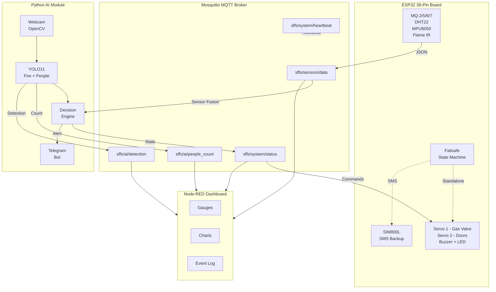

# 🔥 SFFS — Smart Fire Fighting System

## Complete Deployment Guide & System Walkthrough

---

## 1. System Architecture



---

## 2. ESP32 Firmware — Standard ESP32 38-Pin Board

> [!IMPORTANT]
> This firmware targets the **ESP32 WROOM-32 (38-pin)** development board — **NOT** the ESP32-S3.
> Key constraint: **ADC2 pins cannot be used when WiFi is active.** All analog sensors must use ADC1 pins (GPIO 32–39).

### File Structure

```
ProjectGrd-1/
├── include/
│   ├── config.h          # All pins, thresholds, WiFi/MQTT settings
│   ├── filters.h         # EMA filter class (header-only)
│   ├── sensors.h         # Sensor manager: MQ, DHT22, MPU6050, Flame
│   ├── gsm.h             # Non-blocking SIM800L state machine
│   ├── wifi_manager.h    # WiFi auto-reconnect manager
│   ├── mqtt_handler.h    # MQTT JSON publish/subscribe + command parsing
│   ├── actuators.h       # Servo + buzzer controller
│   └── failsafe.h        # Autonomous failsafe state machine
├── src/
│   ├── main.cpp          # Main orchestrator (non-blocking loop)
│   ├── sensors.cpp       # Sensor reading + EMA filtering + tilt calc
│   ├── gsm.cpp           # SIM800L AT command FSM
│   ├── wifi_manager.cpp  # WiFi connection lifecycle
│   ├── mqtt_handler.cpp  # ArduinoJson serialization + PubSubClient
│   ├── actuators.cpp     # ESP32Servo PWM control
│   └── failsafe.cpp      # State transitions + event buffering
└── platformio.ini        # Board: esp32dev + library dependencies
```

### Hardware Wiring — ESP32 38-Pin

> [!WARNING]
> **ADC2 pins (GPIO 0, 2, 4, 12–15, 25–27)** are unusable for analog input when WiFi is active.
> **GPIO 6–11** are connected to the internal flash and must never be used.
> **GPIO 34, 35, 36, 39** are **input-only** (no internal pull-up).

| Component | GPIO | Pin Type | Notes |
|---|---|---|---|
| **MQ-2** (Smoke) | **GPIO 32** | ADC1_CH4 | Voltage divider 5V→3.3V required |
| **MQ-5** (LPG) | **GPIO 33** | ADC1_CH5 | Voltage divider 5V→3.3V required |
| **MQ-6** (Butane) | **GPIO 34** | ADC1_CH6 | Input-only — fine for analog read |
| **MQ-7** (CO) | **GPIO 35** | ADC1_CH7 | Input-only — fine for analog read |
| **Flame IR** | **GPIO 27** | Digital IN | Active LOW |
| **DHT22** | **GPIO 26** | Digital | 10kΩ pull-up to 3.3V |
| **MPU6050 SDA** | **GPIO 21** | I2C | 4.7kΩ pull-up (ESP32 default) |
| **MPU6050 SCL** | **GPIO 22** | I2C | 4.7kΩ pull-up (ESP32 default) |
| **Built-in LED** | **GPIO 2** | Digital OUT | Boot indicator only |
| **Buzzer** | **GPIO 4** | Digital OUT | Active buzzer module |
| **Servo 1** (Gas Valve) | **GPIO 18** | PWM | SG90, 50Hz |
| **Servo 2** (Doors) | **GPIO 19** | PWM | SG90, 50Hz |
| **Pump 1** (Water) | **GPIO 5** | Digital OUT | Relay IN1 (Active LOW) |
| **Pump 2** (Water) | **GPIO 23** | Digital OUT | Relay IN2 (Active LOW) |
| **🟢 Green LED** | **GPIO 13** | Digital OUT | SAFE state indicator |
| **🟠 Orange LED** | **GPIO 14** | Digital OUT | SMOKE state indicator |
| **🔴 Red LED** | **GPIO 25** | Digital OUT | FIRE / GAS_LEAK state indicator |
| **HC-SR04 TRIG** | **GPIO 15** | Digital OUT | Trigger pulse output |
| **HC-SR04 ECHO** | **GPIO 36 (VP / SP)** | Input-only | ⚠️ Voltage divider 5V→3.3V required |
| **Button 1** (Room 1) | **GPIO 12** | Digital IN | INPUT_PULLDOWN, active HIGH |
| **Button 2** (Room 2) | **GPIO 39 (VN / SN)** | Input-only | External pull-down, active HIGH |
| **SIM800L TX→** | **GPIO 16** | UART2 RX | ESP32 receives from SIM800L |
| **SIM800L RX←** | **GPIO 17** | UART2 TX | ESP32 sends to SIM800L |

> [!CAUTION]
> The SIM800L operates at **3.4V–4.4V** (NOT 5V, NOT 3.3V). It needs its own buck converter + 1000µF decoupling capacitor. Use a **voltage divider on the TX line** from ESP32 (3.3V) to SIM800L (4V logic).

### ESP32 38-Pin Pinout Reference

```
              ┌────────────────────┐
        3.3V ─┤                    ├─ VIN (5V) → Relay VCC + HC-SR04 VCC
         GND ─┤                    ├─ GND
  GPIO 15 TRG─┤                    ├─ GPIO 13 🟢LED
  GPIO  2 LED─┤                    ├─ GPIO 12 BTN1
  GPIO  4 BUZ─┤                    ├─ GPIO 14 🟠LED
  GPIO 16 RX2─┤                    ├─ GPIO 27 FLAME
  GPIO 17 TX2─┤                    ├─ GPIO 26 DHT22
 GPIO  5 PMP1─┤    ESP32 38-Pin    ├─ GPIO 25 🔴LED
  GPIO 18 SV1─┤                    ├─ GPIO 33 MQ5
  GPIO 19 SV2─┤                    ├─ GPIO 32 MQ2
  GPIO 21 SDA─┤                    ├─ GPIO 35 MQ7
   GPIO 3 RX0─┤                    ├─ GPIO 34 MQ6
   GPIO 1 TX0─┤                    ├─ GPIO 39 BTN2 (VN / SN)
  GPIO 22 SCL─┤                    ├─ GPIO 36 ECHO (VP / SP)
 GPIO 23 PMP2─┤                    ├─ EN
              └────────────────────┘
```

### Configuration

Before uploading, edit [config.h](file:///D:/Graduation%20Project/iot/ProjectGrd-1/ProjectGrd-1/include/config.h):

```cpp
#define WIFI_SSID       "YOUR_WIFI_SSID"
#define WIFI_PASSWORD   "YOUR_WIFI_PASSWORD"
#define MQTT_BROKER     "192.168.1.100"   // Your laptop's IP
#define GSM_PHONE_NUMBER "+201050532924"   // SMS recipient
```

### Upload

```bash
cd "D:\Graduation Project\iot\ProjectGrd-1\ProjectGrd-1"
# In VS Code: Ctrl+Alt+U  (PlatformIO Upload)
# Or via CLI: pio run --target upload
```

### Failsafe State Machine

```
┌──────────┐  WiFi/MQTT lost  ┌───────────┐  Danger >30s  ┌──────────────────┐
│  NORMAL  │─────────────────►│ DEGRADED  │──────────────►│ STANDALONE_ALERT │
│          │                  │           │  (no AI resp) │ • Gas valve SHUT │
│ AI valid │◄─────────────────│           │               │ • Buzzer ON      │
│          │  Stable 10s      │           │◄──────────────│ • SMS via GSM    │
└──────────┘◄─────────────────┴───────────┘  WiFi back    └──────────────────┘
      ▲          RECOVERY                                        │
      └──────────────────────────────────────────────────────────┘
```

---

## 3. Python AI Module

### File Structure

```
Real-Time-Smoke-Fire-Detection-YOLO11/
├── src/
│   ├── config.py             # Centralized settings (env vars, paths, MQTT)
│   ├── fire_detector.py      # YOLO11 fire/smoke detection engine
│   ├── occupancy_tracker.py  # People entry/exit tracking
│   ├── decision_engine.py    # Sensor + camera data fusion
│   ├── mqtt_client.py        # MQTT bridge to ESP32
│   ├── notification_service.py  # Telegram + WhatsApp alerts
│   ├── main_integrated.py    # Main orchestrator
│   ├── bot.py                # Telegram bot /start & /help
│   ├── main.py               # Legacy standalone fire detection
│   └── yolo11n.pt            # YOLOv11 nano person model
├── models/
│   └── best_nano_111.pt      # Custom fire/smoke YOLO model
├── .env                      # Secrets (Telegram token, MQTT settings)
├── .env.example              # Template for .env
└── requirements.txt          # Python dependencies
```

### Setup & Run

```bash
cd "D:\Graduation Project\cv\Real-Time-Smoke-Fire-Detection-YOLO11"

# 1. Install dependencies
pip install -r requirements.txt

# 2. Configure .env (copy from .env.example and fill in values)
copy .env.example .env
# Edit .env with your Telegram token, MQTT broker IP, etc.

# 3. Run the integrated system
cd src
python main_integrated.py
```

### GPU vs CPU Selection

On startup, the system presents a device selection menu:
- **GPU (Option 1)**: Both fire detection and people tracking run on every frame. Best performance.
- **CPU (Option 2)**: Fire detection runs every 3rd frame to save cycles. **People tracking always runs every frame** to maintain ID continuity.

### Decision Engine States & Actuator Logic

| State | Camera | Sensors | Gas Valve | Doors | Buzzer | Pump 1 | Pump 2 | LEDs |
|---|---|---|---|---|---|---|---|---|
| **SAFE** | No detection | All normal | OPEN | CLOSE | OFF | OFF | OFF | 🟢 Green ON |
| **GAS_LEAK** | No fire/smoke | Gas HIGH | CLOSE | OPEN | ON | OFF | OFF | 🔴 Red ON |
| **SMOKE** | Smoke detected | — | CLOSE | CLOSE | ON | OFF | OFF | 🟠 Orange ON |
| **FIRE** | Fire OR Smoke+Gas | — | CLOSE | OPEN | ON | ON | ON | 🔴 Red ON |

> [!NOTE]
> **Manual Alarm Button Overrides**:
> When a manual alarm push button is pressed, it bypasses the AI decision logic entirely and escalates immediately:
> - **Button 1 (Room 1) Pressed**: Gas Valve CLOSE, Doors OPEN, Buzzer ON, **Pump 1 ON**, Pump 2 OFF, 🔴 Red LED ON.
> - **Button 2 (Room 2) Pressed**: Gas Valve CLOSE, Doors OPEN, Buzzer ON, Pump 1 OFF, **Pump 2 ON**, 🔴 Red LED ON.
> - Releasing both buttons will return the system to normal AI-controlled operation.

---

## 4. Mosquitto MQTT Broker

### Install (on Laptop)

```bash
# Download Mosquitto from https://mosquitto.org/download/
# After installation, verify:
mosquitto -v
```

### Run

```bash
# Start with default config (port 1883, no auth)
mosquitto -v

# Or as a Windows service (auto-start):
net start mosquitto
```

### Verify with CLI tools

```bash
# In one terminal — subscribe to all SFFS topics:
mosquitto_sub -h localhost -t "sffs/#" -v

# In another terminal — simulate an AI command:
mosquitto_pub -h localhost -t "sffs/system/status" -m "{\"state\":\"FIRE\",\"confidence\":0.95,\"source\":\"TEST\",\"actions\":{\"gas_valve\":\"CLOSE\",\"doors\":\"OPEN\",\"buzzer\":\"ON\"}}"
```

---

## 5. Node-RED Dashboard

### Install & Setup

```bash
# Install Node-RED (requires Node.js)
npm install -g node-red

# Install Dashboard widgets
cd %USERPROFILE%\.node-red
npm install node-red-dashboard

# Start Node-RED
node-red
```

### Import the Flow

1. Open Node-RED editor: `http://localhost:1880`
2. Click **☰ Menu → Import → Clipboard**
3. Paste the contents of [nodered_dashboard_flow.json](file:///D:/Graduation%20Project/iot/nodered_dashboard_flow.json)
4. Click **Deploy**
5. Open the Dashboard: `http://localhost:1880/ui`

| Group | Widgets | Description |
|---|---|---|
| System Status | State indicator, confidence, source, flame, tilt, **AI Camera Detection** | Large colored state badge showing threat level and camera status |
| Gas Sensors | 4× gauges (MQ2, MQ5, MQ6, MQ7) | Green/yellow/red zones (threshold: 2000) |
| Environment | Temp gauge, humidity gauge, temp chart | 5-minute rolling temperature history |
| Water Tank | **Water Level gauge (0-100%)** | Shows percentage of water in the tank from HC-SR04 |
| Manual Alarms | **Manual Alarm Status** | Shows active room alarms (Room 1 or Room 2 buttons) |
| Occupancy | People count display | Large number with color coding |
| Actuator Status | Gas Valve, Doors, Buzzer, **Pump 1, Pump 2** | Real-time actuator positions and pump status |
| ESP32 Health | RSSI gauge, uptime, heap, mode, heartbeat | System diagnostics |
| Event Log | Scrolling monospace log | Color-coded by threat level (includes manual button & camera events) |

---

## 6. End-to-End Startup Sequence

```
Step 1:  Start Mosquitto broker on laptop
           mosquitto -v

Step 2:  Start Node-RED dashboard
           node-red
           → Open http://localhost:1880/ui

Step 3:  Power on the ESP32
           → Watch Serial Monitor for boot messages
           → Verify WiFi + MQTT connection
           → Wait 60s for MQ sensor warm-up

Step 4:  Start Python AI module
           cd src && python main_integrated.py
           → Select GPU or CPU
           → Verify webcam opens
           → Verify MQTT connection in console

Step 5:  Verify end-to-end data flow
           → Dashboard shows live gas gauges
           → AI camera shows HUD overlay
           → State indicator shows "SAFE"
```

---

## 7. Failsafe Testing Procedure

### Test 1: WiFi Dropout
1. System running normally (SAFE state)
2. **Action**: Disconnect the laptop's WiFi hotspot
3. **Expected**: ESP32 transitions to DEGRADED within 15s
4. **Verify**: Serial Monitor shows `[Failsafe] NORMAL → DEGRADED`

### Test 2: Sustained Danger without AI
1. ESP32 in DEGRADED mode (WiFi off)
2. **Action**: Hold a lighter near the MQ-2 sensor for >30 seconds
3. **Expected**: ESP32 transitions to STANDALONE_ALERT
4. **Verify**: Gas valve servo closes, buzzer activates, SMS sent

### Test 3: Recovery
1. ESP32 in STANDALONE_ALERT mode
2. **Action**: Reconnect WiFi hotspot
3. **Expected**: ESP32 transitions to RECOVERY, then NORMAL after 10s
4. **Verify**: Actuators return to safe defaults, missed events logged

### Test 4: AI Command Override
1. System running normally with AI connected
2. **Action**: Present fire image to webcam
3. **Expected**: AI publishes FIRE state → ESP32 closes gas valve, opens doors
4. **Verify**: Telegram alert received with occupant count

---

## 8. MQTT Topic Reference

| Topic | Publisher | Subscriber | QoS | Payload |
|---|---|---|---|---|
| `sffs/sensors/data` | ESP32 | AI, Dashboard | 0 | Sensor telemetry JSON |
| `sffs/system/status` | AI | ESP32, Dashboard | 1 | State + actuator commands |
| `sffs/system/heartbeat` | ESP32 | AI, Dashboard | 0 | `{"status":"alive"}` |
| `sffs/ai/detection` | AI | Dashboard | 0 | Detection type + confidence |
| `sffs/ai/people_count` | AI | Dashboard | 0 | `{"inside_count": N}` |

---

## 9. Files Modified/Created in This Session

### ESP32 Firmware (IoT)

| File | Status | Description |
|---|---|---|
| [platformio.ini](file:///D:/Graduation%20Project/iot/ProjectGrd-1/ProjectGrd-1/platformio.ini) | Modified | Board: `esp32dev`, all library deps |
| [config.h](file:///D:/Graduation%20Project/iot/ProjectGrd-1/ProjectGrd-1/include/config.h) | Modified | Full pin map for ESP32 38-pin + WiFi/MQTT |
| [filters.h](file:///D:/Graduation%20Project/iot/ProjectGrd-1/ProjectGrd-1/include/filters.h) | Unchanged | EMA filter (header-only) |
| [sensors.h](file:///D:/Graduation%20Project/iot/ProjectGrd-1/ProjectGrd-1/include/sensors.h) | Modified | Added DHT22 + MPU6050 |
| [sensors.cpp](file:///D:/Graduation%20Project/iot/ProjectGrd-1/ProjectGrd-1/src/sensors.cpp) | Modified | DHT22 reads + tilt angle calculation |
| [gsm.h](file:///D:/Graduation%20Project/iot/ProjectGrd-1/ProjectGrd-1/include/gsm.h) | Bugfix | Fixed `ERROR_COOLDown` → `ERROR_COOLDOWN` |
| [gsm.cpp](file:///D:/Graduation%20Project/iot/ProjectGrd-1/ProjectGrd-1/src/gsm.cpp) | Unchanged | Non-blocking AT command FSM |
| [wifi_manager.h](file:///D:/Graduation%20Project/iot/ProjectGrd-1/ProjectGrd-1/include/wifi_manager.h) | **NEW** | WiFi auto-reconnect manager |
| [wifi_manager.cpp](file:///D:/Graduation%20Project/iot/ProjectGrd-1/ProjectGrd-1/src/wifi_manager.cpp) | **NEW** | Non-blocking reconnection |
| [mqtt_handler.h](file:///D:/Graduation%20Project/iot/ProjectGrd-1/ProjectGrd-1/include/mqtt_handler.h) | **NEW** | MQTT JSON publish/subscribe |
| [mqtt_handler.cpp](file:///D:/Graduation%20Project/iot/ProjectGrd-1/ProjectGrd-1/src/mqtt_handler.cpp) | **NEW** | ArduinoJson + PubSubClient |
| [actuators.h](file:///D:/Graduation%20Project/iot/ProjectGrd-1/ProjectGrd-1/include/actuators.h) | **NEW** | Servo + buzzer control |
| [actuators.cpp](file:///D:/Graduation%20Project/iot/ProjectGrd-1/ProjectGrd-1/src/actuators.cpp) | **NEW** | ESP32Servo PWM driver |
| [failsafe.h](file:///D:/Graduation%20Project/iot/ProjectGrd-1/ProjectGrd-1/include/failsafe.h) | **NEW** | Failsafe state machine |
| [failsafe.cpp](file:///D:/Graduation%20Project/iot/ProjectGrd-1/ProjectGrd-1/src/failsafe.cpp) | **NEW** | State transitions + event buffer |
| [main.cpp](file:///D:/Graduation%20Project/iot/ProjectGrd-1/ProjectGrd-1/src/main.cpp) | Modified | Full orchestrator using Serial2 |

### Python AI Module (CV)

| File | Status | Description |
|---|---|---|
| [mqtt_client.py](file:///D:/Graduation%20Project/cv/Real-Time-Smoke-Fire-Detection-YOLO11/src/mqtt_client.py) | **NEW** | Thread-safe MQTT bridge |
| [occupancy_tracker.py](file:///D:/Graduation%20Project/cv/Real-Time-Smoke-Fire-Detection-YOLO11/src/occupancy_tracker.py) | **NEW** | OOP people counter |
| [decision_engine.py](file:///D:/Graduation%20Project/cv/Real-Time-Smoke-Fire-Detection-YOLO11/src/decision_engine.py) | **NEW** | Data fusion state machine |
| [main_integrated.py](file:///D:/Graduation%20Project/cv/Real-Time-Smoke-Fire-Detection-YOLO11/src/main_integrated.py) | **NEW** | Main AI orchestrator |
| [config.py](file:///D:/Graduation%20Project/cv/Real-Time-Smoke-Fire-Detection-YOLO11/src/config.py) | Modified | Added MQTT/video settings + dynamic model path resolution |
| [requirements.txt](file:///D:/Graduation%20Project/cv/Real-Time-Smoke-Fire-Detection-YOLO11/requirements.txt) | Modified | Added paho-mqtt |

### Dashboard

| File | Status | Description |
|---|---|---|
| [nodered_dashboard_flow.json](file:///D:/Graduation%20Project/iot/nodered_dashboard_flow.json) | **NEW** | Full importable dashboard flow |

---

## 10. Compilation & Size Verification

The ESP32 firmware was compiled successfully using PlatformIO with the following resource utilization:
- **RAM**: `14.2%` (46,440 bytes out of 327,680 bytes)
- **Flash**: `63.8%` (836,737 bytes out of 1,310,720 bytes)
